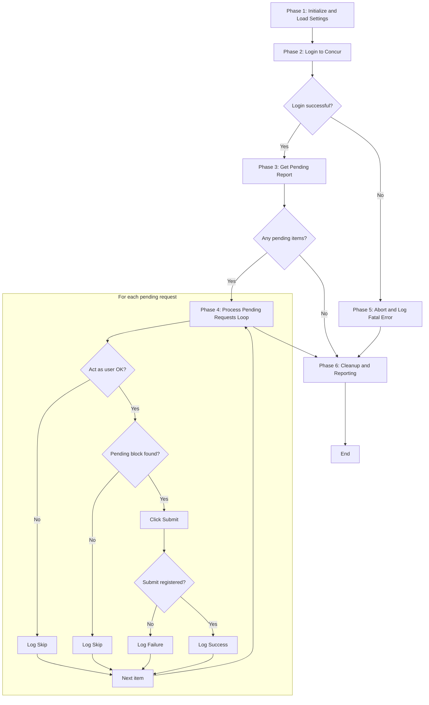

# High-Level Design — Concur Cash Advance Auto-Submit Bot

**Status:** Phase 2 — proposed, pending user confirmation.
**Platform:** Power Automate Desktop (primary), UiPath (fallback).

## Logical Phases

1. **Initialize & Load Settings** — Read configuration (Concur URL, admin credentials, file paths, retry count), prepare the run log, and launch the browser.
2. **Login to Concur** — Authenticate as the admin account and confirm we've landed on the home/dashboard.
3. **Get Pending Report** — Open the admin grid of pending Cash Advance Requests, export to Excel, and read it into a list of records (User ID + request identifier per row).
4. **Process Pending Requests (Loop)** — For each record: Act as the user → open their Cash Advances screen → find the pending block → click in → Submit → verify → log outcome → clear Act-as. Each item is isolated so one failure doesn't stop the rest.
5. **Exception Handling** — Cross-cutting: retries for transient web failures, skip-and-log for per-item errors, abort-with-log for fatal errors (e.g., login fails).
6. **Cleanup & Reporting** — Write the run summary to the Excel log and close the browser cleanly.

## Phase Flow

Exception handling (Phase 5) is realized as the fatal-abort path plus the per-item Skip/Failure logs inside the loop — in PA Desktop via On-Error settings and error-handling blocks, in UiPath via Try-Catch.
