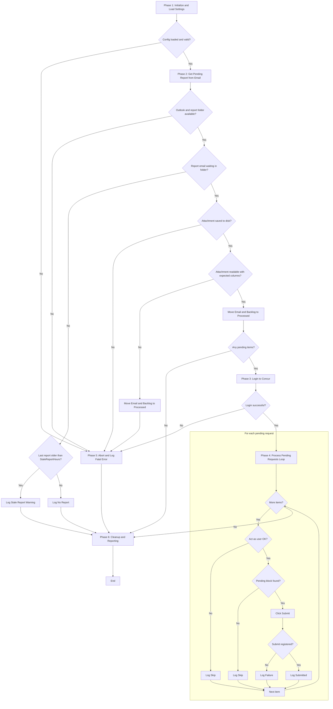

# High-Level Design — Concur Cash Advance Auto-Submit Bot

**Status:** Phase 2 — **confirmed by the user (2026-08-06)**, including the folder-membership revision. Settled.
**Platform:** UiPath.

## Logical Phases

1. **Initialize & Load Settings** — Read `Config.xlsx` into the config Dictionary (Concur URL, retry count and delay, timeouts, log path, expected report sender/subject, Outlook report folder and `Processed` subfolder, attachment folder, `StaleReportHours`, and login secrets *only if* the chosen login method needs any — the preferred WIA/SSO option has none), and validate that the required keys are present. Neither the browser nor the run-log workbook is opened here: `runLogTable` is built in memory *before* this phase (the R8 prologue) and the Excel file is written only in Phase 6.
2. **Get Pending Report** — Read *Cash Advance open items* report emails from the configured Outlook report folder on the bot machine, matched by sender/subject and **folder membership rather than read status**, sorted newest-first. Save the newest one's Excel attachment under a per-run unique filename, load it into a **`DataTable`** (the sanctioned exception to the Dictionary rule — Phase 4 is genuine tabular row iteration), then move that email and any older backlog reports to `Processed`. If the folder is empty, or the report has no rows, the run ends cleanly here — no browser, no login.
3. **Login to Concur** — Launch the browser, authenticate as the admin account, and confirm we've landed on the home/dashboard. Reached only when there is work to do; this phase owns the browser's lifetime.
4. **Process Pending Requests (Loop)** — For each record: Act as the user → open their Cash Advances screen → find the pending block → click in → Submit → verify → log outcome → clear Act-as. Each item is isolated so one failure doesn't stop the rest.
5. **Exception Handling** — Cross-cutting: retries for transient web failures, skip-and-log for per-item errors, abort-with-log for fatal errors (e.g., login fails).
6. **Cleanup & Reporting** — Write the run summary to the Excel log, delete or archive the saved attachment, and close the browser cleanly. **All three steps are guarded** (`uipath-reference.md` R8): Phase 6 runs from `Finally` on every exit path, including ones that never launched a browser (no report, empty report), never saved an attachment (no report), and — if Phase 1 itself failed — never even loaded the config the log path comes from. Cleanup checks before acting rather than assuming, and each step swallows its own errors so a cleanup failure can't replace the real one.

**Ordering note:** Phases 2 and 3 are deliberately the reverse of the original PA Desktop design, which logged in before fetching the report. Reading Outlook needs no Concur session, so checking for work first means the two clean-exit paths (no new email, empty report) never launch a browser or authenticate at all. On an hourly schedule processing 1–5 items per run, most runs are expected to take one of those exits.

## Phase Flow

```mermaid
graph TD
    A[Phase 1: Initialize and Load Settings] --> A1{Config loaded and valid?}
    A1 -->|No| X[Phase 5: Abort and Log Fatal Error]
    A1 -->|Yes| B[Phase 2: Get Pending Report from Email]
    B --> O{Outlook and report folder available?}
    O -->|No| X
    O -->|Yes| C{Report email waiting in folder?}
    C -->|No| S{Last report older than StaleReportHours?}
    S -->|Yes| W[Log Stale Report Warning] --> H[Phase 6: Cleanup and Reporting]
    S -->|No| N[Log No Report] --> H
    C -->|Yes| SV{Attachment saved to disk?}
    SV -->|No| X
    SV -->|Yes| D{Attachment readable with expected columns?}
    D -->|No| MR[Move Email and Backlog to Processed] --> X
    D -->|Yes| MD[Move Email and Backlog to Processed]
    MD --> E{Any pending items?}
    E -->|No| H
    E -->|Yes| G[Phase 3: Login to Concur]
    G --> G1{Login successful?}
    G1 -->|No| X
    G1 -->|Yes| F[Phase 4: Process Pending Requests Loop]

    subgraph Loop [For each pending request]
        F --> LM{More items?}
        LM -->|Yes| F1{Act as user OK?}
        F1 -->|No| L1[Log Skip] --> FN[Next item]
        F1 -->|Yes| F2{Pending block found?}
        F2 -->|No| L2[Log Skip] --> FN
        F2 -->|Yes| F3[Click Submit]
        F3 --> F4{Submit registered?}
        F4 -->|No| L3[Log Failure] --> FN
        F4 -->|Yes| L4[Log Submitted] --> FN
        FN --> LM
    end

    LM -->|No| H
    X --> H
    H --> Z[End]
```

Exception handling (Phase 5) is realized as the fatal-abort path plus the per-item Skip/Failure logs inside the loop, implemented via UiPath Try-Catch. Note that "no new report email" is a **clean exit, not a fatal path** — Concur's next hourly report re-lists any item that is still open, so a delayed or skipped report costs nothing. Prolonged silence is a different matter, which is what the `StaleReportHours` warning branch exists to surface.

## Open items to verify before build

1. **Is the Concur report a full snapshot or a delta?** Load-bearing for the whole move-early + backlog-drain strategy (see `PDD.md` → Key Design Decisions). Must be confirmed against the actual report definition.
2. **Attachment file format.** Concur report attachments are commonly `.xls`-named HTML or CSV rather than true OOXML, which would make a plain `Read Range` fail. Confirm the real format before the Phase 2 detailed design.
3. **Unattended Outlook access.** Classic UiPath Outlook activities drive Outlook via Interop/MAPI and need an installed Outlook with a loaded mail profile in an interactive session — confirm the robot account satisfies this (see `PDD.md` → Environment prerequisite).
4. **Browser lifetime across phases.** The browser is launched in Phase 3, used in Phase 4, and closed in Phase 6. **The browser must outlive its scope** — browser-variable, or `Use Application/Browser` with Close = Never plus a re-attaching scope. A *single enclosing scope is ruled out*: Phases 3/4 sit in the outer `Try` and Phase 6 in its `Finally`, which are sibling blocks no container can span (`uipath-reference.md` U7). Which of the two remaining options to use is settled in the medium-level design.
5. **Sender/subject filter syntax.** UiPath's Outlook activities take a **DASL/MAPI query string** in the `Filter` property, not a plain expression. Either pin that syntax or filter with LINQ over the returned collection — this shapes Phase 2 directly.
6. **Move-mail mechanism and folder addressing.** How the report folder and its `Processed` subfolder are addressed (`Move Outlook Mail Message` target syntax, nested-folder paths), and confirmation that a move is atomic enough that a crash mid-drain can't lose mail. Note the folder-membership design deliberately avoids the `MarkAsRead` property, which fires at *retrieval* time and so could not express "consume only after the attachment is safely in memory".
7. **Realizing the flow's jumps under Linear-Sequence-only.** The abort edges into `X` and the loop-back `FN → LM` are diagram conveniences, not activities. Under the skill's Sequence-only constraint they become nested `If`/`Try Catch` plus the `runShouldContinue` guard flag and a guarded terminal Sequence — no flow jumps, and specifically no PA-style `Go to`. To be expressed concretely in the medium-level design (`uipath-reference.md` R9).

> This list covers the items that shape the *high-level* structure. It is not the complete set — see `uipath-reference.md` **U1–U12** for every unverified platform behavior, including several (Outlook ordering and attachment collisions, the Concur Act-as / block-matching / submit-confirmation selectors) that only bite at detailed-design time.
