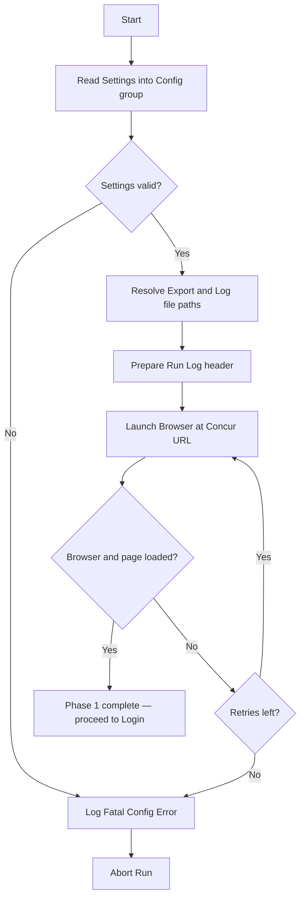
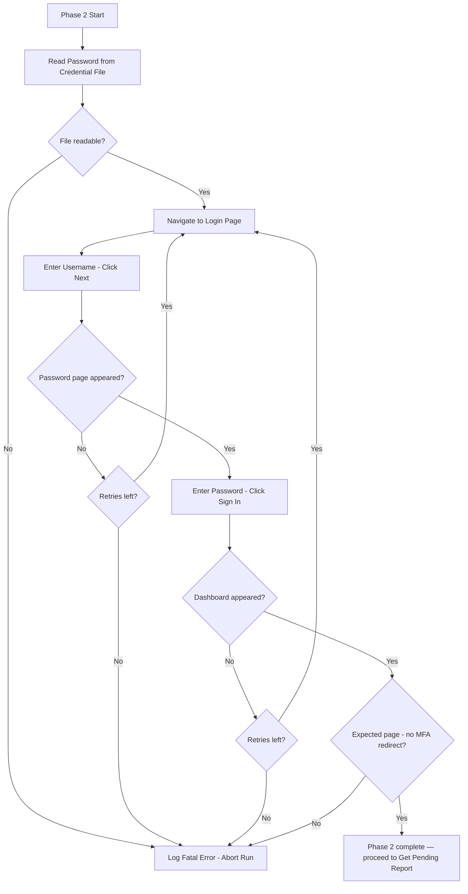
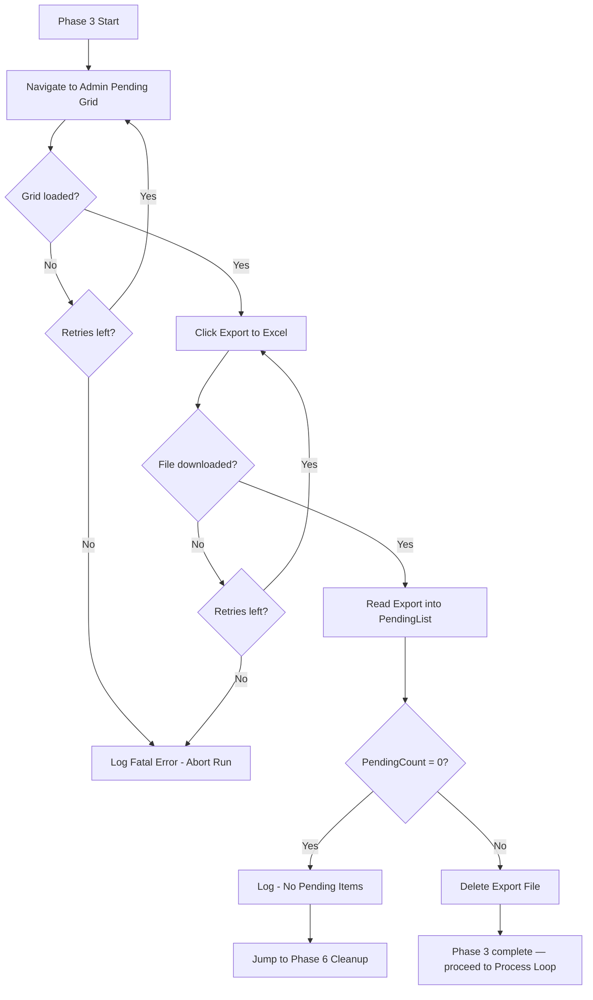
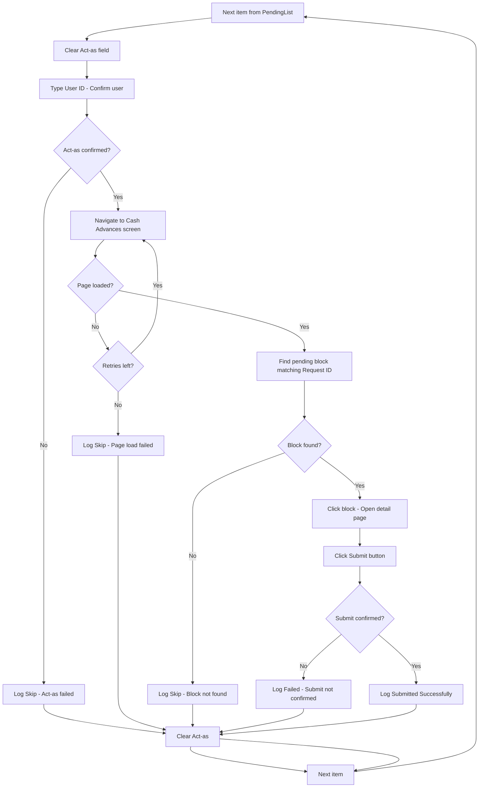
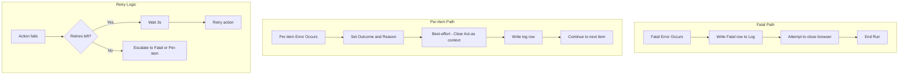
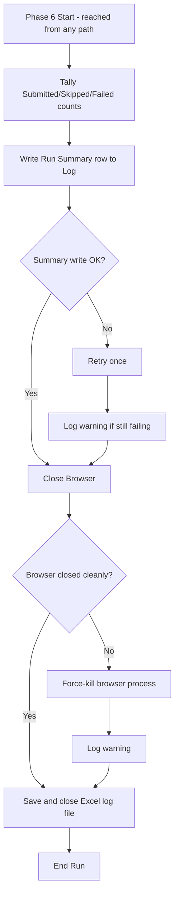

# Medium-Level Design — Concur Cash Advance Auto-Submit Bot

**Status:** Phase 3 — in progress. Confirming one phase at a time.
**Platform:** Power Automate Desktop (primary), UiPath (fallback).

---

## Phase 1 of 6: Initialize & Load Settings

### Purpose & Scope
Prepare everything the run needs before touching Concur: load settings and credentials, set up the Excel run-log for this execution, and launch a clean browser session. If this phase fails, nothing else can run — so failures here are fatal (abort the run).

### Key Steps (logical)
1. **Read settings** — load the config values the bot needs (see variables below). In PA Desktop these come from flat variables / a small settings file; kept as one "config" group so it maps to a UiPath Config.xlsx later.
2. **Resolve run paths** — build the export file path and the run-log file path (with a date/time stamp so runs don't overwrite each other).
3. **Prepare the run log** — create or open the Excel log and ensure the header row exists (Timestamp, User ID, Request ID, Outcome, Reason).
4. **Launch browser** — open a fresh browser instance at the Concur login URL, maximized, with no leftover session/tabs.

### Variables & Data Structures

**Config group (the "settings"):**

| Variable | Type | Example / Notes |
|---|---|---|
| `ConcurBaseUrl` | Text | Login URL of the Concur web app |
| `AdminUser` | Text | Admin account username |
| `AdminPassword` | Text | Admin password (held as sensitive var, never logged) |
| `ExportFolderPath` | Text | Where Concur's Excel export lands |
| `LogFolderPath` | Text | Where the run log is written |
| `MaxRetry` | Number | Retry count for transient web failures (e.g., 3) |
| `TimeoutSeconds` | Number | Default wait for web elements (e.g., 30) |

**Run-state variables initialized here:**

| Variable | Type | Notes |
|---|---|---|
| `RunTimestamp` | Text | e.g., `yyyyMMdd_HHmmss`, used in file names |
| `LogFilePath` | Text | Resolved full path to this run's log |
| `Browser` | Browser handle | The launched browser instance |

### Error Handling
- Settings missing/empty (blank URL or credentials) → **fatal**: write a "config error" line to the log if possible, then stop the run.
- Browser fails to launch or the login page doesn't load → **retry up to `MaxRetry`**, then **fatal abort** with a logged error.
- All failures here go down the Phase 5 "Abort and Log Fatal Error" path — we never proceed to login with a broken setup.

### Decisions (confirmed)
1. **Credential storage:** external credential file (path stored in config; file read at startup, never logged).
2. **Log file style:** rolling daily file — one file per calendar day, each hourly run appends rows to it. File named e.g. `ConcurLog_20260630.xlsx`. Suits the daily email summary phase.

### Internal Flow

---

## Phase 2 of 6: Login to Concur

> ⚠️ **BLOCKED — pending login method decision.**
> Password login requires 2FA. Two options under investigation: (1) SSO with Windows Integrated Auth (preferred — silent, no extra steps); (2) magic link via email (automatable but fragile). Needs IT/Azure AD confirmation before this phase can be finalised. Design continues on other phases in the meantime.

### Purpose & Scope
Authenticate the admin account in the browser and land on the Concur home/dashboard. A failed login is fatal — the bot cannot impersonate any user if it isn't logged in. Retries cover transient page-load issues; a true credential failure should abort immediately (no point retrying bad credentials).

### Key Steps (logical)
1. **Navigate to login page** — go to `ConcurBaseUrl` if not already there.
2. **Enter username** — type `AdminUser` into the username field and click Next (or press Enter) to proceed to page 2.
3. **Wait for password page** — confirm the password field appears before typing.
4. **Enter password** — read the password from the external credential file and type into the password field.
5. **Click Sign In** — submit the password form.
6. **Verify login success** — wait for the home/dashboard element to appear (e.g., the top navigation or user avatar). If it doesn't appear within `TimeoutSeconds`, treat as login failure.
7. **Confirm no MFA/SSO redirect** — if an unexpected page appears (not the dashboard), abort with a descriptive error.

### Variables introduced
| Variable | Type | Notes |
|---|---|---|
| `AdminPassword` | Text (sensitive) | Read from external credential file; never logged |
| `LoginSuccess` | Boolean | Set `true` once dashboard confirmed |

### Error Handling
- Credential file not found or unreadable → **fatal abort** (logged).
- Username/password field not found (page didn't load) → **retry up to `MaxRetry`**, then fatal abort.
- Dashboard element never appears after submit → **retry login sequence**, then fatal abort. Do not retry indefinitely on a bad password.
- Unexpected redirect (MFA, SSO, error page) → **fatal abort** with page URL logged so it's diagnosable.

### Internal Flow

## Phase 3 of 6: Get Pending Report

### Purpose & Scope
Navigate to the admin grid of pending Cash Advance Requests, export it to Excel, read the exported file into a list the loop will iterate over, and decide whether there is any work to do. If the list is empty, the bot exits cleanly without touching any user account.

### Key Steps (logical)
1. **Navigate to the admin pending grid** — go to the Cash Advance Requests section and ensure the view is filtered to pending submission status only.
2. **Trigger the Excel export** — click the export button, wait for the browser download to complete and the file to appear in `ExportFolderPath`.
3. **Verify the export file exists** — confirm the file landed within `TimeoutSeconds`; if not, retry or abort.
4. **Read the export into a list** — open the Excel file and load all data rows into `PendingList` (one record per pending request). Each record carries at minimum: User ID, Request ID/Name.
5. **Check for empty list** — if `PendingCount = 0`, log "No pending items — run complete" and jump directly to Phase 6 (Cleanup), skipping the loop entirely.
6. **Delete or archive the export file** — remove the downloaded export so it doesn't accumulate or interfere with the next run.

### Variables introduced
| Variable | Type | Notes |
|---|---|---|
| `ExportFilePath` | Text | Full path to the downloaded export file |
| `PendingList` | List of records | One entry per pending request (User ID, Request ID/Name) |
| `PendingCount` | Number | Row count of `PendingList`; 0 triggers early exit |
| `CurrentIndex` | Number | Loop counter — initialized here to 0, used in Phase 4 |

### Error Handling
- Admin grid page fails to load → **retry up to `MaxRetry`**, then fatal abort.
- Export button not found or download times out → **retry**, then fatal abort.
- Export file unreadable or has no header row → **fatal abort** with file path logged.
- Empty list (`PendingCount = 0`) → **clean exit** (not an error): log "nothing to process" and proceed to Phase 6.

### Internal Flow

## Phase 4 of 6: Process Pending Requests (Loop)

### Purpose & Scope
Iterate over every row in `PendingList` and, for each one: impersonate the user via "Act as", navigate to their Cash Advances screen, locate the pending block, open it, and click Submit. Each item is fully isolated — one failure logs and skips to the next, never killing the whole run. At the end of each item the bot clears "Act as" and returns to admin context before processing the next.

### Key Steps (logical — per iteration)

**A. Switch to user context**
1. Locate the "Act as" field (top-right of Concur).
2. Clear any existing "Act as" value.
3. Type the User ID from the current row and confirm/select the user.
4. Verify the page reflects the correct user (name shown in "Act as" badge).

**B. Navigate to Cash Advances**
5. Navigate to the Cash Advances screen for the impersonated user.
6. Wait for the card grid to load.

**C. Locate the pending block**
7. Scan the card grid for a block matching the Request ID/Name from the current row **and** in pending submission status. Request ID/Name is visible on the card face — no need to click in first.
8. If not found → log "Block not found / Skipped" and jump to step E (clear context).

**D. Submit**
9. Click the matching pending block to open it.
10. Wait for the request detail page to load.
11. Click the **Submit** button.
12. Verify submit registered — confirm the Submit button disappears or the status changes away from pending. If neither happens within `TimeoutSeconds` → log "Submit failed" and jump to step E.
13. Log "Submitted successfully" with User ID, Request ID, and timestamp.

**E. Clear user context**
14. Click the dedicated "back to admin / stop acting as" button. Wait for confirmation that the page has returned to admin context (admin name shown in the top-right, not the impersonated user) before moving to the next row.

### Variables introduced
| Variable | Type | Notes |
|---|---|---|
| `CurrentRecord` | Record | The current row from `PendingList` (User ID, Request ID/Name) |
| `CurrentUserID` | Text | User ID from current row |
| `CurrentRequestID` | Text | Request ID/Name from current row |
| `ItemOutcome` | Text | "Submitted" / "Skipped" / "Failed" for this item |
| `ItemReason` | Text | Detail written to log (e.g., "Block not found", "Submit timeout") |
| `SubmitConfirmed` | Boolean | True when submit success is verified |

### Error Handling (per-item isolation)
Every step inside the loop runs inside an error-handling block. Any unexpected error:
- Sets `ItemOutcome = "Failed"` and `ItemReason = error detail`
- Attempts to clear "Act as" (best-effort — to avoid contaminating the next iteration)
- Logs the outcome
- Moves to the next row

Specific cases:
| Scenario | Action |
|---|---|
| "Act as" switch fails (user not found / field error) | Log "Skip — Act as failed", clear context, next item |
| Cash Advances page fails to load | Retry up to `MaxRetry`, then log "Skip — page load failed" |
| Pending block not found on screen | Log "Skip — block not found", clear context, next item |
| Submit button not found on detail page | Log "Skip — submit button not found", clear context, next item |
| Submit click succeeds but status doesn't change | Log "Failed — submit not confirmed", clear context, next item |
| Any unhandled error mid-item | Log "Failed — unexpected error + detail", clear context, next item |

### Internal Flow (single iteration)

## Phase 5 of 6: Exception Handling

### Purpose & Scope
Exception handling is not a separate sequential phase — it is a cross-cutting strategy applied throughout all other phases. This section documents the complete error handling model so it can be implemented consistently in Phase 4 (Detailed Design) and serves as the reference for any deviation during build.

Two tiers of exceptions exist:

- **Fatal (run-level):** Something has gone wrong that makes it impossible to continue the run at all. Abort, log the error, attempt cleanup, and exit.
- **Per-item (loop-level):** Something has gone wrong for one record only. Log, skip that item, clear Act-as context, and continue with the next.

### Error Classification

| Scenario | Tier | Action |
|---|---|---|
| Config/credential file missing or unreadable | Fatal | Log error, abort run |
| Browser fails to launch | Fatal | Retry × `MaxRetry`, then abort |
| Login page fails to load | Fatal | Retry × `MaxRetry`, then abort |
| Login fails (bad credentials / unexpected redirect) | Fatal | Log error + page URL, abort |
| Admin pending grid fails to load | Fatal | Retry × `MaxRetry`, then abort |
| Export file never appears after download | Fatal | Retry × `MaxRetry`, then abort |
| Export file unreadable / missing headers | Fatal | Log error, abort |
| "Act as" switch fails for a user | Per-item | Log "Skip — Act as failed", clear context, next item |
| Cash Advances page fails to load after retries | Per-item | Log "Skip — page load failed", next item |
| Pending block not found on grid | Per-item | Log "Skip — block not found", next item |
| Submit button not found on detail page | Per-item | Log "Skip — submit button missing", next item |
| Submit click does not confirm within timeout | Per-item | Log "Failed — submit unconfirmed", next item |
| "Stop acting as" button not found | Per-item | Log warning, attempt page refresh to restore context, next item |
| Any unhandled/unexpected error inside the loop | Per-item | Log "Failed — unexpected: [error detail]", best-effort context clear, next item |

### Retry Strategy
- **Where retries apply:** page loads and downloads only — not business actions (Submit clicks are not retried; a failed submit is logged and skipped).
- **Retry count:** `MaxRetry` (set in config, default 3).
- **Retry delay:** short fixed pause between attempts (e.g., 3 seconds) to allow transient network issues to clear.
- **Retry scope:** retries restart the full sub-sequence (e.g., full page navigation, not just the failed click).

### Logging Standard
Every outcome — success or failure — writes one row to the rolling daily Excel log:

| Column | Value |
|---|---|
| Timestamp | Date and time of the outcome |
| RunID | `RunTimestamp` from Phase 1 — groups all rows from one run |
| UserID | User being processed |
| RequestID | Request ID/Name from the export |
| Outcome | "Submitted" / "Skipped" / "Failed" / "Fatal" / "No items" |
| Reason | Human-readable detail (e.g., "Block not found", "Act as failed", "Submit unconfirmed") |

Fatal errors also write a "Fatal" row before the run aborts, so every run has at least one log entry regardless of how it ended.

### Internal Flow

## Phase 6 of 6: Cleanup & Reporting

### Purpose & Scope
Bring the run to a clean, predictable close regardless of how it got here — whether every item processed normally, the list was empty, or a fatal error aborted the run early. Ensures the browser and any open resources are always released, and writes a final run-summary row so each run is easy to audit at a glance.

### Key Steps (logical)
1. **Compute run summary** — tally counts from this run's log rows: `SubmittedCount`, `SkippedCount`, `FailedCount`, and total processed.
2. **Write summary row** — append one summary row to the rolling daily log (Outcome = "Run Summary"), distinct from the per-item rows, so the daily email (future phase) can report totals without recomputing them.
3. **Close the browser** — close all tabs/windows and end the browser process cleanly, even if it's already in an error state.
4. **Final log flush** — ensure the Excel file is saved and properly closed (no lock file left behind) so the next hourly run and the future daily-email process can both read it.
5. **End run** — normal completion for both the happy path and the "no pending items" early-exit path from Phase 3.

### Variables introduced
| Variable | Type | Notes |
|---|---|---|
| `SubmittedCount` | Number | Count of "Submitted" outcomes this run |
| `SkippedCount` | Number | Count of "Skipped" outcomes this run |
| `FailedCount` | Number | Count of "Failed" outcomes this run |
| `RunEndTimestamp` | Text | Time the run finished, written to the summary row |

### Error Handling
- This phase is the terminal point for **every** path (happy path, empty-list early exit, and fatal abort) — it must not itself introduce a new fatal error.
- Browser close failures are logged as a **warning only** (not fatal) — the run has already completed its actual work; a stuck browser process is a housekeeping issue, not a run failure. Best-effort kill of the browser process if the graceful close fails.
- Excel file save/close failures are logged as a **warning only**, with a retry (e.g., wait 2s and retry once) — the per-item and fatal-error rows have typically already been written incrementally during the run, so a summary-write failure doesn't lose the detailed log.

### Internal Flow

---

## Full-Design Notes
- Every phase past Phase 1 assumes the config, run log path, and browser handle established in Phase 1 remain valid for the whole run.
- Phase 2 (Login) is currently **blocked** pending the SSO/magic-link decision — Phases 3–6 are designed independently of the login mechanism and do not need to change once that's resolved, since login only affects how the browser session is authenticated before Phase 3 begins.
