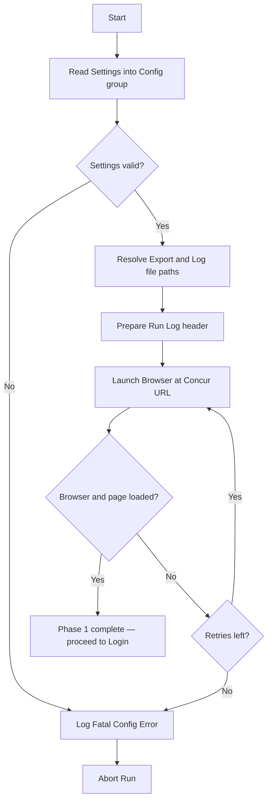

# Medium-Level Design — Concur Cash Advance Auto-Submit Bot

**Status:** Phase 3 — in progress. Confirming one phase at a time.
**Platform:** Power Automate Desktop (primary), UiPath (fallback).

---

## Phase 1 of 6: Initialize & Load Settings

### Purpose & Scope
Prepare everything the run needs before touching Concur: load settings and credentials, set up the Excel run-log for this execution, and launch a clean browser session. If this phase fails, nothing else can run — so failures here are fatal (abort the run).

### Key Steps (logical)
1. **Read settings** — load the config values the bot needs (see variables below). In PA Desktop these come from flat variables / a small settings file; kept as one "config" group so it maps to a UiPath Config.xlsx later.
2. **Resolve run paths** — build the export file path and the run-log file path (with a date/time stamp so runs don't overwrite each other).
3. **Prepare the run log** — create or open the Excel log and ensure the header row exists (Timestamp, User ID, Request ID, Outcome, Reason).
4. **Launch browser** — open a fresh browser instance at the Concur login URL, maximized, with no leftover session/tabs.

### Variables & Data Structures

**Config group (the "settings"):**

| Variable | Type | Example / Notes |
|---|---|---|
| `ConcurBaseUrl` | Text | Login URL of the Concur web app |
| `AdminUser` | Text | Admin account username |
| `AdminPassword` | Text | Admin password (held as sensitive var, never logged) |
| `ExportFolderPath` | Text | Where Concur's Excel export lands |
| `LogFolderPath` | Text | Where the run log is written |
| `MaxRetry` | Number | Retry count for transient web failures (e.g., 3) |
| `TimeoutSeconds` | Number | Default wait for web elements (e.g., 30) |

**Run-state variables initialized here:**

| Variable | Type | Notes |
|---|---|---|
| `RunTimestamp` | Text | e.g., `yyyyMMdd_HHmmss`, used in file names |
| `LogFilePath` | Text | Resolved full path to this run's log |
| `Browser` | Browser handle | The launched browser instance |

### Error Handling
- Settings missing/empty (blank URL or credentials) → **fatal**: write a "config error" line to the log if possible, then stop the run.
- Browser fails to launch or the login page doesn't load → **retry up to `MaxRetry`**, then **fatal abort** with a logged error.
- All failures here go down the Phase 5 "Abort and Log Fatal Error" path — we never proceed to login with a broken setup.

### Open Questions (to confirm before Phase 4)
1. **Credential storage:** admin password held as a PA Desktop sensitive variable, or read from Windows Credential Manager / a protected file?
2. **Log file style:** one new timestamped file per run, or a single rolling daily file that every run appends to? (A rolling daily file may suit the later daily-email summary better.)

### Internal Flow

---

## Phase 2 of 6: Login to Concur
*Pending confirmation of Phase 1.*

## Phase 3 of 6: Get Pending Report
*Pending confirmation of Phase 2.*

## Phase 4 of 6: Process Pending Requests (Loop)
*Pending confirmation of Phase 3.*

## Phase 5 of 6: Exception Handling
*Pending confirmation of Phase 4.*

## Phase 6 of 6: Cleanup & Reporting
*Pending confirmation of Phase 5.*
