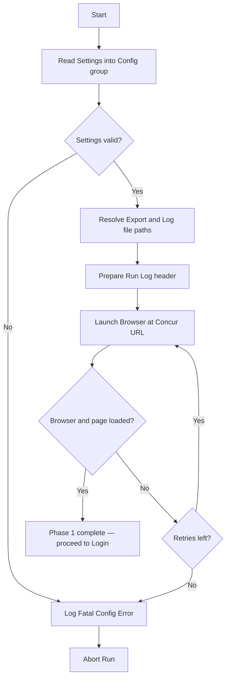
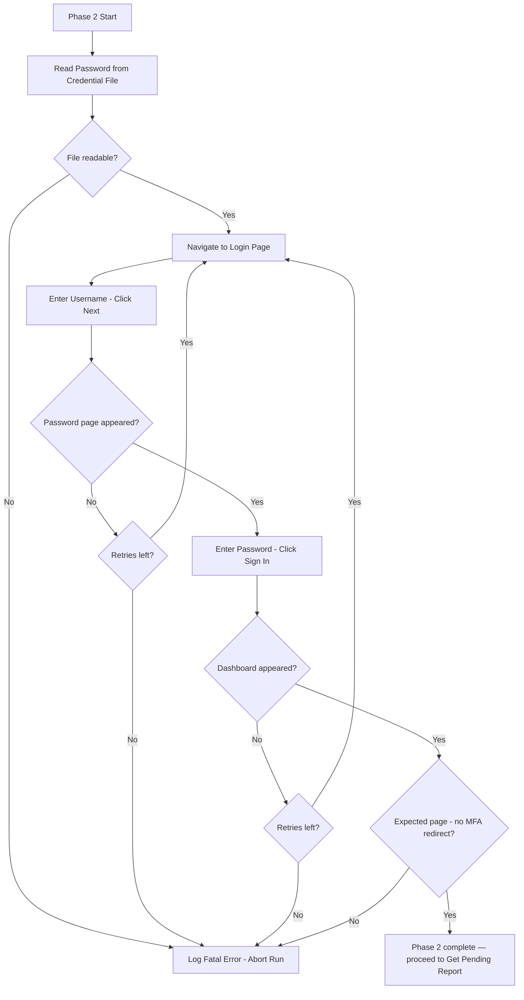

# Medium-Level Design — Concur Cash Advance Auto-Submit Bot

**Status:** Phase 3 — in progress. Confirming one phase at a time.
**Platform:** Power Automate Desktop (primary), UiPath (fallback).

---

## Phase 1 of 6: Initialize & Load Settings

### Purpose & Scope
Prepare everything the run needs before touching Concur: load settings and credentials, set up the Excel run-log for this execution, and launch a clean browser session. If this phase fails, nothing else can run — so failures here are fatal (abort the run).

### Key Steps (logical)
1. **Read settings** — load the config values the bot needs (see variables below). In PA Desktop these come from flat variables / a small settings file; kept as one "config" group so it maps to a UiPath Config.xlsx later.
2. **Resolve run paths** — build the export file path and the run-log file path (with a date/time stamp so runs don't overwrite each other).
3. **Prepare the run log** — create or open the Excel log and ensure the header row exists (Timestamp, User ID, Request ID, Outcome, Reason).
4. **Launch browser** — open a fresh browser instance at the Concur login URL, maximized, with no leftover session/tabs.

### Variables & Data Structures

**Config group (the "settings"):**

| Variable | Type | Example / Notes |
|---|---|---|
| `ConcurBaseUrl` | Text | Login URL of the Concur web app |
| `AdminUser` | Text | Admin account username |
| `AdminPassword` | Text | Admin password (held as sensitive var, never logged) |
| `ExportFolderPath` | Text | Where Concur's Excel export lands |
| `LogFolderPath` | Text | Where the run log is written |
| `MaxRetry` | Number | Retry count for transient web failures (e.g., 3) |
| `TimeoutSeconds` | Number | Default wait for web elements (e.g., 30) |

**Run-state variables initialized here:**

| Variable | Type | Notes |
|---|---|---|
| `RunTimestamp` | Text | e.g., `yyyyMMdd_HHmmss`, used in file names |
| `LogFilePath` | Text | Resolved full path to this run's log |
| `Browser` | Browser handle | The launched browser instance |

### Error Handling
- Settings missing/empty (blank URL or credentials) → **fatal**: write a "config error" line to the log if possible, then stop the run.
- Browser fails to launch or the login page doesn't load → **retry up to `MaxRetry`**, then **fatal abort** with a logged error.
- All failures here go down the Phase 5 "Abort and Log Fatal Error" path — we never proceed to login with a broken setup.

### Decisions (confirmed)
1. **Credential storage:** external credential file (path stored in config; file read at startup, never logged).
2. **Log file style:** rolling daily file — one file per calendar day, each hourly run appends rows to it. File named e.g. `ConcurLog_20260630.xlsx`. Suits the daily email summary phase.

### Internal Flow

---

## Phase 2 of 6: Login to Concur

### Purpose & Scope
Authenticate the admin account in the browser and land on the Concur home/dashboard. A failed login is fatal — the bot cannot impersonate any user if it isn't logged in. Retries cover transient page-load issues; a true credential failure should abort immediately (no point retrying bad credentials).

### Key Steps (logical)
1. **Navigate to login page** — go to `ConcurBaseUrl` if not already there.
2. **Enter username** — type `AdminUser` into the username field and click Next (or press Enter) to proceed to page 2.
3. **Wait for password page** — confirm the password field appears before typing.
4. **Enter password** — read the password from the external credential file and type into the password field.
5. **Click Sign In** — submit the password form.
6. **Verify login success** — wait for the home/dashboard element to appear (e.g., the top navigation or user avatar). If it doesn't appear within `TimeoutSeconds`, treat as login failure.
7. **Confirm no MFA/SSO redirect** — if an unexpected page appears (not the dashboard), abort with a descriptive error.

### Variables introduced
| Variable | Type | Notes |
|---|---|---|
| `AdminPassword` | Text (sensitive) | Read from external credential file; never logged |
| `LoginSuccess` | Boolean | Set `true` once dashboard confirmed |

### Error Handling
- Credential file not found or unreadable → **fatal abort** (logged).
- Username/password field not found (page didn't load) → **retry up to `MaxRetry`**, then fatal abort.
- Dashboard element never appears after submit → **retry login sequence**, then fatal abort. Do not retry indefinitely on a bad password.
- Unexpected redirect (MFA, SSO, error page) → **fatal abort** with page URL logged so it's diagnosable.

### Internal Flow

## Phase 3 of 6: Get Pending Report
*Pending confirmation of Phase 2.*

## Phase 4 of 6: Process Pending Requests (Loop)
*Pending confirmation of Phase 3.*

## Phase 5 of 6: Exception Handling
*Pending confirmation of Phase 4.*

## Phase 6 of 6: Cleanup & Reporting
*Pending confirmation of Phase 5.*
