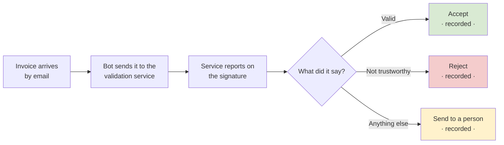

# Invoice Signature Check — How It Would Work

> **Discussion draft.** Written to be talked over with Finance, IT and Compliance. It describes the
> *business process*, not the build. Technical design lives in the reference docs alongside this file.
>
> ⛔ Not a signed-off design — the process below still has open questions, listed at the end.

---

## Today

An invoice arrives by email. Someone opens the PDF, goes to the government validation website
(ETDA), uploads the file, waits, and reads off whether the invoice carries a valid digital signature.
Then they act on it.

## Proposed

The same check, done automatically, every time, with the answer written down.

Nothing is thrown away and nothing is guessed. Every invoice ends up in one of those three places, with
a record of why.

---

## The one thing everyone needs to agree on

**"Is the signature valid?" has five possible answers, not two.**

| The service says | What it means | What we'd do |
|---|---|---|
| ✅ **Valid** | Signed, and the signature holds up | Accept |
| ❌ **Not trustworthy** | The document was changed after signing, or signed with a dead certificate | Reject |
| ⚠️ **Valid, with a caveat** | e.g. only part of the document is actually covered by the signature | Person looks |
| ⬜ **No signature found** | Either genuinely unsigned, or signed in a format the service can't read | Person looks |
| ❔ **Couldn't check** | The service was down or unreachable. **This says nothing about the invoice.** | Person looks, try again later |

**The last row is the one that matters.** If "couldn't check" gets treated as "unsigned", then a bad
morning at ETDA looks to Finance like *a batch of unsigned invoices from your suppliers* — a confident,
completely wrong answer that someone might act on.

At roughly 10 invoices a week, sending the middle three to a person costs about **one review a week**.

---

## The trap worth knowing about

**An expired certificate does not mean an invalid invoice.**

If a supplier signed an invoice two years ago and their signing certificate has since expired, the
invoice is *still validly signed* — the signature was made while the certificate was live. The
validation service treats it as valid, and so should we.

Anyone who builds this as "check the expiry date" will start rejecting perfectly good older invoices,
and nothing will look broken. Worth stating plainly to whoever builds it.

---

## What we'd need from each team

| Who | What we need |
|---|---|
| **Finance / AP** | **Where should the answer go?** A list you check, a reply to the supplier, a folder, a flag in another system? *This is the biggest open question — the process can't be finished without it.* |
| **Finance / AP** | Which mailbox do invoices arrive in, and how do we tell an invoice email from everything else? Can one email carry several invoices? |
| **Finance / AP** | Are the three "person looks" cases right, or should any of them be automatic? |
| **IT** | Two quick feasibility checks — whether our tenant allows the bot to reach an outside service, and whether we can host the small component that does the checking. Both are fast to confirm. |
| **Compliance / Data Protection** | We would be sending every supplier invoice to a government service automatically, rather than a person uploading the occasional one. Also worth knowing: **ETDA does not guarantee its own results are accurate**, and disclaims liability for relying on them. |

---

## Honest caveats

- **We haven't confirmed we can build it this way yet.** Two IT checks decide it. If either fails, the
  process above is unchanged — same steps, same five answers — but it gets built differently, with a
  different cost.
- **Nobody has yet confirmed the ETDA service will let us use it automatically.** It's free and it has
  an interface designed for exactly this, but we're asking them in writing before relying on it.
- **The bot can fail silently.** If its connection to the mailbox quietly expires, it stops and looks
  identical to a quiet week. The design handles this, but somebody needs to be the one who gets told.
- **Volume assumption:** ~10 invoices a week. If that's seasonal or growing, say so — it changes the
  manual-review estimate and one or two design choices.
