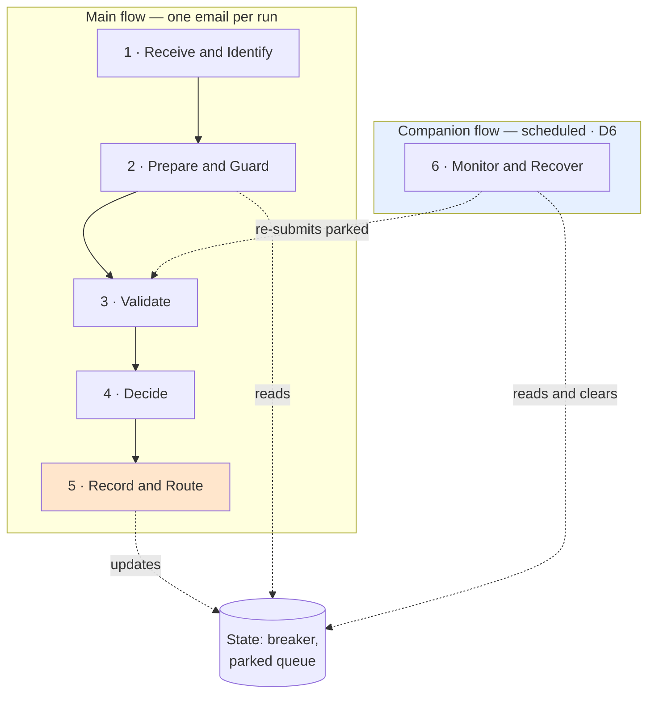
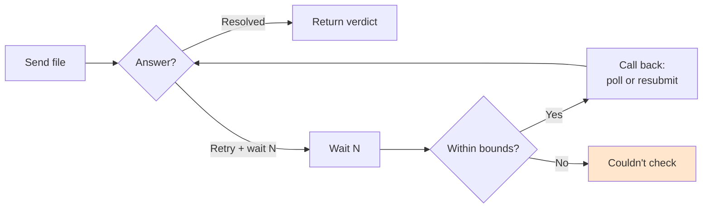

# Medium-Level Workflow — DISCUSSION DRAFT

> ⛔ **Not the confirmed Phase 3 artifact.** The repo's process runs Discovery → High-Level →
> Medium-Level, confirming each before the next, and **none of the three is confirmed yet** (the PDD is
> blocked on `PROGRESS.md` Q5). This is drafted whole so there is something to work against; the
> per-phase confirmation loop still has to happen, and it has **not** been through the
> `rpa-design-reviewer`.
>
> **Phase 5 is deliberately incomplete** — it cannot be designed until Q5 says where the verdict goes.
> Everything else is designed around that hole, per `CLAUDE.md`: flag the blocked phase, keep designing
> the ones that don't depend on it.

**Companion docs:** `power-automate-reference.md` (how it's built), `teda-validation-api-reference.md`
(what ETDA does), `high-level-workflow-DRAFT.md` (the business view).

---

## Shape of the whole thing

Two flows. The main one is triggered by mail; the companion runs on a schedule and exists because the
main one cannot detect its own silence.

⚠️ **Everything from Phase 2 onward is per *attachment*, not per email.** One email may carry several
invoices; a failure on one must not block the others. Confirmed only once Q4 answers whether that
happens in practice.

**Wrapping all of it:** a Try / Catch / Finally scope structure. The **Finally always writes a run
record** — this is load-bearing, because a successful run shows nothing about what it actually produced
(`power-automate-reference.md` 🔬 V3).

---

## Phase 1 · Receive and Identify

**Purpose.** Turn an arriving email into zero or more files that need checking.

**Steps.**
1. Trigger on new mail in the watched mailbox/folder.
2. Enumerate attachments.
3. Keep those that are invoices — PDF or XML.
4. Discard or set aside the rest.
5. Record what arrived and what was selected.

**Data out.** Message identity, and per attachment: an id, filename, content type, size.

**Error handling.** Mailbox unreachable → the run fails and alerts; it is not an invoice problem.
**No invoice attachments is the ordinary case, not an error** — at ~10 invoices/week most mail will be
something else. It must complete quietly, or the log becomes noise nobody reads.

**Open.** Q4 — which mailbox, and the rule that says "this is an invoice email". Q10 — what happens to a
non-invoice attachment.

---

## Phase 2 · Prepare and Guard

**Purpose.** Cheap local checks, so we never spend a call we already know will fail.

**Steps.**
1. Read configuration **once** into a single object.
2. Read circuit-breaker state.
3. **If tripped** → park this attachment, alert, stop. Do not call out.
4. Check size against the per-type limit — PDF and XML limits differ by nearly 7×.
5. Check the file is a type the service accepts.

**Data out.** Config object; breaker state; a pass/park/reject decision per attachment.

**Error handling.** Config unreadable → **terminate the run and alert.** Running without config means
running on defaults nobody chose, which is worse than not running. Oversized or wrong-type → a business
exception, straight to a person; no call is made.

**Open.** Q8 — the breaker threshold. The config mechanism itself is gated on the build environment
being named (`power-automate-reference.md` U8).

---

## Phase 3 · Validate

**Purpose.** Get an answer about one file. This is the **only** phase that reaches ETDA, and it does so
through a single isolated component (`power-automate-reference.md` R14).

**Steps.**
1. Send the file and its identity to the validation component.
2. The component hashes it, submits to ETDA, and polls within its own time bound.
3. It returns either a **resolved answer** or **"retry, come back in N seconds, and here's why"**.
4. On retry: wait, then call back — **polling** an existing transaction, or **resubmitting** the file,
   depending on the reason.
5. Repeat within two bounds. Exhausting either ends the attempt as *Couldn't check*.

**Data out.** The verdict, per-signature detail, and the transaction identifiers — **all of them**, since
a resubmit creates a second one and any of them may be needed to query ETDA later.

**Error handling.** The component absorbs ETDA's error codes entirely; nothing outside this phase reads
one. Two bounds prevent an invoice looping forever: a total elapsed ceiling, and a cap on call-backs.

**Why the file goes back rather than being held.** A resubmit may happen up to half an hour later. The
flow **re-fetches the attachment from the mailbox** rather than stashing it anywhere — anything that
re-saves the file breaks its signature, and ETDA would report that as *tampering*.

**Open.** Q8 — the timing values.

---

## Phase 4 · Decide

**Purpose.** Turn what the service found into what we do about it. Two distinct things.

**Steps.**
1. Read the **outcome** — one of five (Trusted, Untrusted, Warning, No supported signature, Couldn't
   check).
2. Where a file carries several signatures, the worst one governs.
3. Map outcome → **disposition** (Accept / Reject / Manual review) from config.
4. An unrecognised outcome → *Couldn't check* → manual review. **Never a pass, never a silent reject.**

**Data out.** Outcome, disposition, and the supporting detail a human would need.

**Error handling.** This phase has no external dependency, so it cannot fail on its own. Its risk is
logical, and it is the one the whole design turns on: **"couldn't check" must never collapse into "not
signed"**, or an outage reports as a batch of unsigned invoices.

**Settled.** The mapping is decision D4. It lives in config, so changing it is an edit.

---

## Phase 5 · Record and Route ⛔ BLOCKED

**Purpose.** Make the verdict durable, and put the invoice where it needs to go.

**What is certain regardless of Q5:**
- A **run record** is always written, from Finally, on every path.
- The **verdict and transaction identifiers** are persisted — run history won't show them later.
- The **circuit-breaker counter** is updated: reset on a real answer, incremented on *Couldn't check*.

**What is blocked on Q5:** the destination, the format, who is notified, and whether anything is sent
back to the supplier. That is most of the phase.

⚠️ One constraint to carry into the Q5 conversation: **write to a fixed destination, not a computed
one.** If the target is built from an expression — a dated folder, say — and that expression drifts, the
platform creates the new location and reports success. Verdicts would go somewhere nobody is looking,
with every run green.

**Open.** Q5 (the whole phase), Q14 (how long the audit trail is kept), Q12 (the same invoice twice).

---

## Phase 6 · Monitor and Recover *(companion flow — D6)*

**Purpose.** Three jobs the main flow structurally cannot do for itself.

**Steps.**
1. **Heartbeat** — has the main flow run recently? A dead mailbox connection stops the trigger
   silently: no run, no error, indistinguishable from a quiet week.
2. **Probe and clear** — if the breaker is tripped, test whether the service is back, and clear it.
3. **Drain** — re-submit invoices parked while the breaker was tripped. Nothing else will: the mail
   trigger won't fire again for a message it has already handled.

**Error handling.** Bounded so a permanently-failing invoice can't cycle park → drain → park forever;
after a few attempts it ends as *Couldn't check* and goes to a person.

⚠️ **This flow carries no verdict logic of its own.** It re-enters the same validation path as the main
flow. If the two ever disagreed about an outcome, that would be a defect.

**Open.** Q15 — who is told, and how fast, for three different events: the breaker tripping, invoices
sitting parked, and a single invoice ending *Couldn't check*.

---

## Where to start confirming

The phases are not equally settled. Suggested order:

1. **Phase 1** — needs Q4, and Q4 is a short conversation with Finance.
2. **Phase 4** — already settled by D4; confirming it is a sanity check, not a decision.
3. **Phase 3** — the mechanics are worked out; what's open is only the timing numbers in Q8.
4. **Phase 2 and 6** — depend on Q8 and Q15.
5. **Phase 5 last** — it cannot be finished before Q5, and Q5 shapes it more than anything else shapes
   any other phase.
