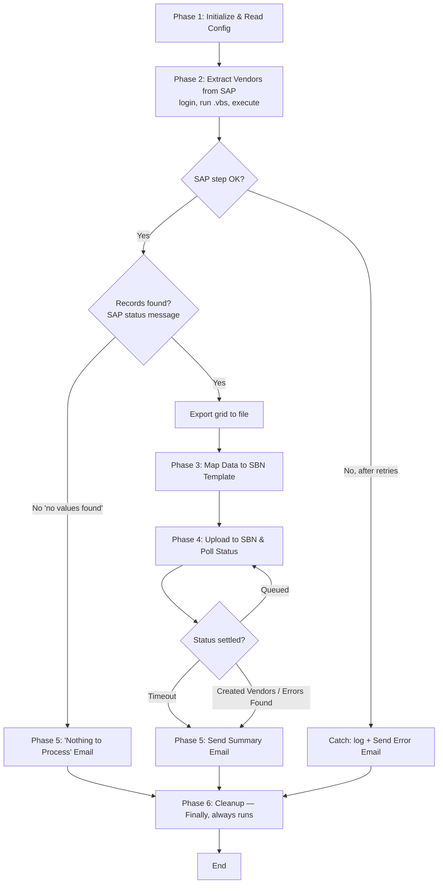

# High-Level Design — Daily Vendor SBN Upload Bot

**Status:** Awaiting user confirmation (Phase 2).
**Platform:** UiPath (linear nested Sequences, Config.xlsx, Dictionary data, all in Main.xaml).

The process decomposes into **six phases** wrapped in a single outer **Try-Catch-Finally**. Phases 1–5 run inside the Try; the Catch sends an error email on any unhandled failure; the **Finally always runs Phase 6 (Cleanup)** so no application is ever left open, regardless of which path the run exits on. Each phase is a named `Sequence` container inside `Main.xaml`.

## Phases

### Phase 1 — Initialize & Read Config
Start logging ("Bot started"), read `Config.xlsx` (Name/Value) into the config Dictionary. Config holds: SAP `.vbs` script path, export output path, SBN CSV template path, dated CSV output path, SBN portal URL, email recipients, retry count, poll interval, poll timeout, and any environment-specific values. No business logic — just setup.

### Phase 2 — Extract Vendors from SAP
1. **Log into SAP GUI** (open SAP Logon / establish the session the `.vbs` will attach to).
2. Inject today's date and the export output path into the parameterized SAP GUI script, run it via **Invoke VBScript / Invoke Code** (stays in Main.xaml). The script opens SE16N → table **LFA1**, enters the create-date criteria, and executes.
3. **Check the SAP status-bar message** — SE16N returns a "No values were found" (no-records) message when nothing matches. This is the **empty-day check**: if no records, set the empty flag and skip straight to Phase 5's "nothing to process" email (no export, no mapping).
4. If records exist, the script exports the result grid to a file; confirm the export file was produced.

Wrapped in retry logic — on SAP failure (won't open / login fail / script error), retry up to the configured count, then raise to the outer Catch (→ error email; Finally still cleans up).

### Phase 3 — Map Data to SBN Template
(Reached only when Phase 2 confirmed records exist.) Read the SAP export into structured data, load the SBN CSV template, copy the **six fields** (Vendor Name, Vendor ID, Tax ID, City, Country, Email) into the fixed SBN columns — straight copy, no transformation. Capture the **vendor count** and vendor IDs for the summary email. **Generate the dated upload name once** here — `RPA_Upload_ddMMyyyy_HHmm` — store it in a variable, and use it for both the CSV filename and (in Phase 4) the SBN upload Name so they always match. Save the CSV.

### Phase 4 — Upload to SBN & Poll Status
Log into the SBN web portal, open the **Upload Vendors** page. Type the upload **Name** (the variable from Phase 3), choose the saved CSV, leave **Perform AN Supplier Matching unchecked**, click **Upload**. Locate the new row in the **Upload Details** table by its unique Name, then loop: **Refresh Status** → read status. While **Queued**, wait the poll interval and refresh again, up to the poll timeout. Capture the final status: **Created Vendors**, **Errors Found**, or **(timed out) still queued**.

### Phase 5 — Send Summary Email
Send the outcome email to the team. Two variants:
- **Normal run:** upload name, vendor count, vendor IDs, and final SBN status, with the **CSV attached**.
- **Empty day (from Phase 2):** a "nothing to process" email; no attachment.

Log the run result.

### Phase 6 — Cleanup (Finally — always runs)
Close SAP, the browser, and Excel cleanly — **on every exit path** (normal completion, empty day, or fatal error), because it lives in the outer Try's **Finally**. Log "Bot finished". No hanging processes or windows.

### Exception Handling (outer Try-Catch-Finally, cross-cutting)
- **SAP failure (Phase 2):** retry per config; on final failure the exception propagates to the **Catch** → log Error + send **error email**. **Finally** then runs Phase 6 cleanup.
- **Other technical failures (any phase):** propagate to the **Catch** → log Error + send **error email**; **Finally** runs cleanup.
- **Empty result (Phase 2):** not an error — detected via SE16N's "no values found" message; routes to Phase 5's "nothing to process" email, then **Finally** cleanup. No export/mapping/upload.
- **Errors Found / timeout (Phase 4):** not a bot failure — captured and reported in the **summary email**; a human investigates in SBN.

## Phase Flow

## Design Notes / Decisions
- **Cleanup is its own phase (Phase 6) in a Finally block**, not folded into Phase 5 — it must run on *every* exit (normal, empty-day, and fatal-error), and only a Finally guarantees that. (Resolves the earlier open question about splitting cleanup out.)
- **Empty-day check sits in Phase 2** — SE16N shows a "no values were found" status message right after execute, so the bot detects an empty result at the SAP step and skips export/mapping/upload, routing to Phase 5's "nothing to process" email. Cleanup still runs via Finally.
- **The dated upload name is generated once (Phase 3)** and reused for both the CSV filename and the SBN upload Name, so they can't diverge at minute granularity.
- **SAP login is the explicit first action of Phase 2**, since the `.vbs` needs an established SAP session to attach to.
- **Errors Found is not a bot failure** — the bot uploads and reports; a human investigates flagged rows in SBN.
- **Status polling has a timeout** (~1–2 min) since it normally resolves in seconds; on timeout the bot reports "still queued" rather than hanging.

## Open Items (carried forward)
1. Scheduled run time.
2. Credential storage / login method for SAP and SBN.
3. Exact SBN CSV header names/order (from user's template).
4. Exact LFA1 source column names for the six mapped fields.
