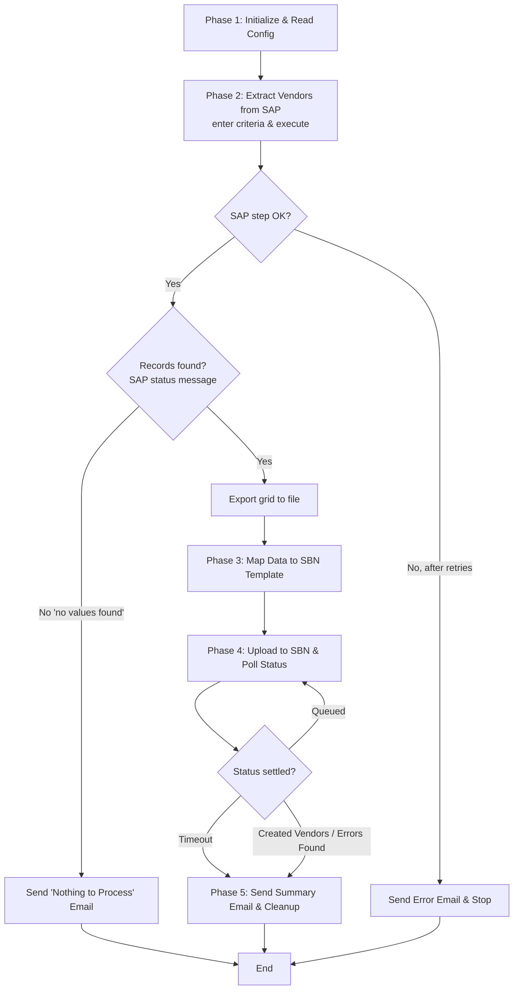

# High-Level Design — Daily Vendor SBN Upload Bot

**Status:** Awaiting user confirmation (Phase 2).
**Platform:** UiPath (linear nested Sequences, Config.xlsx, Dictionary data, all in Main.xaml).

The process decomposes into **five sequential phases** plus a **cross-cutting exception-handling** wrapper. Each phase is a named `Sequence` container inside `Main.xaml`.

## Phases

### Phase 1 — Initialize & Read Config
Start logging ("Bot started"), read `Config.xlsx` (Name/Value) into the config Dictionary. Config holds: SAP `.vbs` script path, export output path, SBN CSV template path, dated CSV output path, SBN portal URL, email recipients, retry count, poll interval, poll timeout, and any environment-specific values. No business logic — just setup.

### Phase 2 — Extract Vendors from SAP
Inject today's date and the export output path into the parameterized SAP GUI script, run it via **Invoke VBScript / Invoke Code** (stays in Main.xaml). After entering the criteria and executing, **check the SAP status-bar message** — SE16N returns a "No values were found" (no-records) message when nothing matches the create-date filter. This is the **empty-day check**: if no records, branch straight to the "nothing to process" email and end (no export, no mapping). If records exist, the script exports the result grid to a file; confirm the export file was produced. Wrapped in retry logic — on SAP failure (won't open / login fail / script error), retry up to the configured count, then raise to the exception handler (→ error email + stop).

### Phase 3 — Map Data to SBN Template
(Reached only when Phase 2 confirmed records exist.) Read the SAP export into structured data, load the SBN CSV template, copy the **six fields** (Vendor Name, Vendor ID, Tax ID, City, Country, Email) into the fixed SBN columns — straight copy, no transformation. Capture the **vendor count** and vendor IDs for the summary email. Save the dated CSV (`RPA_Upload_ddMMyyyy_HHmm.csv`) and continue.

### Phase 4 — Upload to SBN & Poll Status
Log into the SBN web portal, open the **Upload Vendors** page. Type the upload **Name** (`RPA_Upload_ddMMyyyy_HHmm`), choose the saved CSV, leave **Perform AN Supplier Matching unchecked**, click **Upload**. Locate the new row in the **Upload Details** table by its unique Name, then loop: **Refresh Status** → read status. While **Queued**, wait the poll interval and refresh again, up to the poll timeout. Capture the final status: **Created Vendors**, **Errors Found**, or **(timed out) still queued**.

### Phase 5 — Send Summary Email & Cleanup
Send the summary email to the team: upload name, vendor count, vendor IDs, and final SBN status, with the **CSV attached**. Then close SAP, the browser, and Excel cleanly (no hanging processes). Log "Bot completed successfully".

### Exception Handling (cross-cutting)
A Try-Catch strategy around the phases:
- **SAP failure (Phase 2):** retry per config; on final failure → log Error + send **error email** + stop.
- **Other technical failures (any phase):** log Error + send **error email** + attempt clean shutdown.
- **Empty result (Phase 2):** detected via SE16N's "no values found" status message right after execute — not an error; send **"nothing to process"** email and end cleanly (no export/mapping).
- **Errors Found / timeout (Phase 4):** not a bot failure — captured and reported in the **summary email**; a human investigates in SBN.

## Phase Flow

## Design Notes / Decisions
- **Empty-day check sits in Phase 2** — SE16N shows a "no values were found" status message right after execute, so the bot detects an empty result at the SAP step and skips export/mapping entirely. (Vendor count/IDs for the email are still captured in Phase 3 from the export.)
- **Cleanup is folded into Phase 5** to keep the design to five phases. Can be split into a dedicated Phase 6 if preferred.
- **Errors Found is not a bot failure** — the bot's job is to upload and report; a human investigates flagged rows in SBN.
- **Status polling has a timeout** (~1–2 min) since it normally resolves in seconds; on timeout the bot reports "still queued" rather than hanging.

## Open Items (carried forward)
1. Scheduled run time.
2. Credential storage / login method for SAP and SBN.
3. Exact SBN CSV header names/order (from user's template).
4. Exact LFA1 source column names for the six mapped fields.
