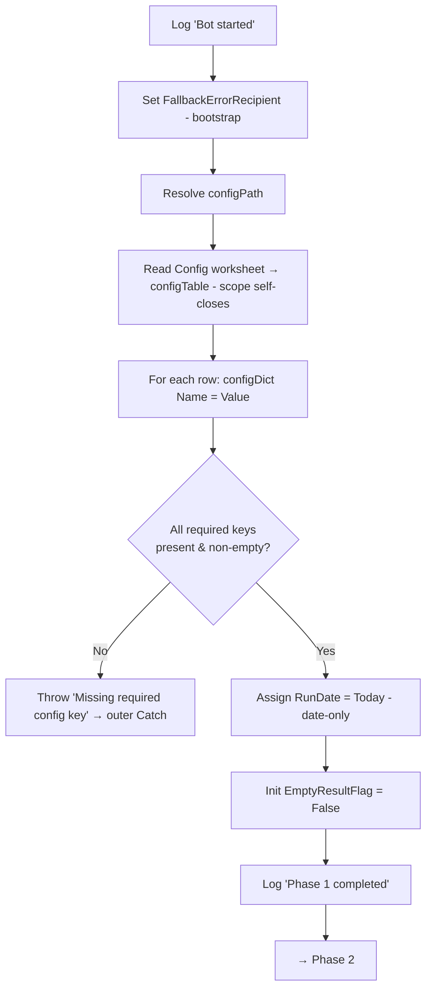
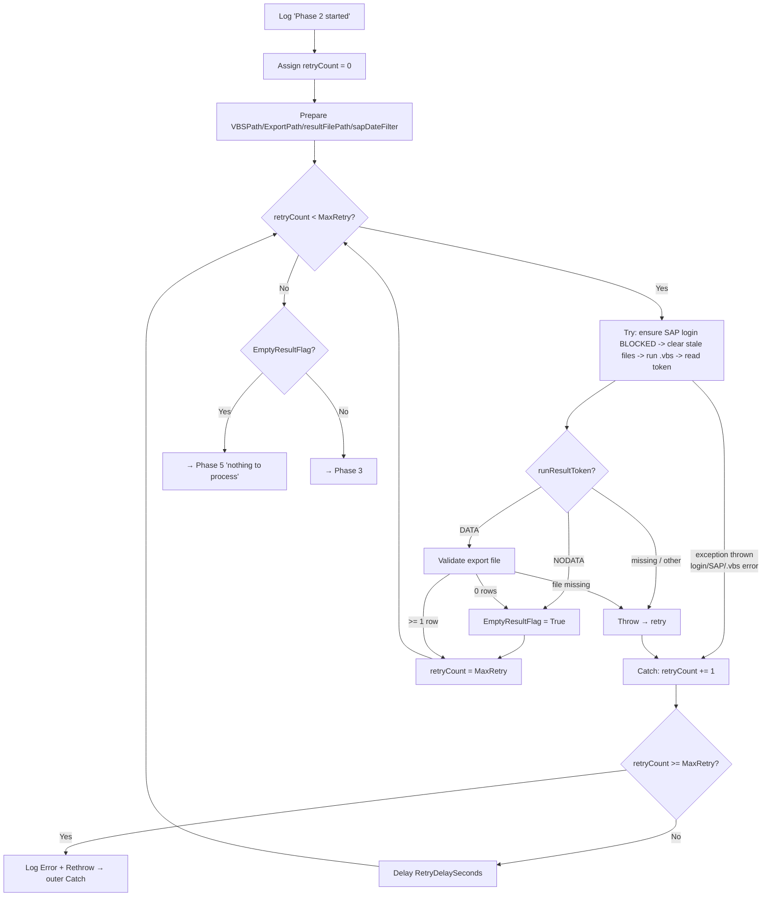

# Medium-Level Design — Daily Vendor SBN Upload Bot

**Platform:** UiPath (see `uipath-reference.md` for rules). **Status:** Medium-level design in progress — **Phase 1/6 confirmed; Phase 2/6 designed (awaiting user confirmation); Phases 3/6–6/6 not yet drafted.** Designed one logical phase at a time.

Each section below designs one of the six phases from the confirmed high-level design: purpose/scope, key logical steps, variables/data structures, error handling, and an internal flow diagram. All six phases run inside `Main.xaml`, wrapped by the outer Try-Catch-Finally (reference P4).

---

## Phase 1/6 — Initialize & Read Config

**Status:** Confirmed by user.

### Purpose & scope
Prepare the run before any business work: begin logging, load `Config.xlsx` into `configDict`, validate that every required setting is present, and initialize the run-level variables the later phases depend on (run date, retry counter, empty-result flag). This phase touches no external application (SAP/SBN/Outlook not opened yet), so its only failure mode is a bad/missing config.

### Key logical steps
1. **Log "Bot started"** (Info) — process name + timestamp.
2. **Set the bootstrap fallback recipient** — `Assign FallbackErrorRecipient = "<admin/support address>"` **before** the config read, so an error email can be sent even if the config load itself fails (see Error handling). This and `configPath` are the only two bootstrap literals allowed (they can't live in Config — they precede/point to it).
3. **Resolve the Config path** — `configPath` from a known project-relative location (e.g. `.\Config.xlsx`).
4. **Read Config worksheet** — read the "Config" sheet (Name/Value) into `configTable` via a `Use Excel File` scope (reference P1); the scope self-closes on exit.
5. **Populate configDict** — for each row, `configDict(Name) = Value`.
6. **Validate required keys** — confirm every required key exists and is non-empty (list below). On any missing/blank key, raise a clear exception (→ outer Catch → error email).
7. **Compute run date** — `RunDate = Today` (date-only). Used **only** for the SE16N create-date filter in Phase 2 and the `ddMMyyyy` date portion of the upload name. The upload name's `HHmm` timestamp is taken from `Now` at Phase 3 (not from `RunDate`), so the name stays minute-unique per run.
8. **Initialize control variables** — `EmptyResultFlag = False`. (`retryCount` is Main-scoped but the operative reset is per-retry-block in Phase 2 per P2 — the value set here is not relied upon.)
9. **Log "Phase 1 completed"** (Info).

### Variables / data structures
| Name | Type | Scope | Initial | Purpose |
|---|---|---|---|---|
| `configPath` | String | Main | `.\Config.xlsx` | Location of Config workbook (bootstrap literal — the working dir must resolve to project root) |
| `FallbackErrorRecipient` | String | Main | `"<admin address>"` | Bootstrap literal — error-email recipient when `configDict` isn't populated |
| `configTable` | DataTable | Main | — | Raw Config sheet read |
| `configDict` | Dictionary(Of String, String) | Main | new | All settings, keyed by Name |
| `RunDate` | DateTime | Main | `Today` | Date-only — SE16N create-date filter + `ddMMyyyy` portion of upload name (NOT the `HHmm`) |
| `EmptyResultFlag` | Boolean | Main | `False` | Set true in Phase 2 if SE16N returns no rows |
| `retryCount` | Int32 | Main | `0` | Shared retry counter; operative reset is per-block in Phase 2 (reference P2) |

### Required Config keys (validated here; values are examples only, real values live in Config.xlsx)
| Key | Used by | Example |
|---|---|---|
| `VBSPath` | Phase 2 | `.\scripts\extract_lfa1.vbs` |
| `ExportPath` | Phase 2/3 | `.\data\lfa1_export.xlsx` |
| `SAPConnectionName` | Phase 2 | `PRD [connection string]` |
| `MaxRetry` | Phase 2 (P2) | `3` |
| `RetryDelaySeconds` | Phase 2 (P2) | `10` |
| `TemplatePath` | Phase 3 | `.\templates\SBN_template.csv` |
| `CSVOutputFolder` | Phase 3 | `.\output\` |
| `SBNUrl` | Phase 4 | `https://...ariba.com/...` |
| `PollIntervalSeconds` | Phase 4 | `5` |
| `PollTimeoutSeconds` | Phase 4 | `120` |
| `EmailRecipients` | Phase 5 | `team@company.com` |
| `EmailFrom` / mail settings | Phase 5 | (per chosen mail mechanism) |

*(Credential keys — SAP/SBN login — are deliberately out of scope until the login method is decided; see Open Items. They will be added to this list then, sourced from Config or a secure store per reference R7.)*

### Error handling
- **Config file missing / unreadable** → exception propagates to the outer Catch → log Error + error email. The `Use Excel File` scope self-closes on exception (reference ⚠️ U4 — unverified; fallback is an explicit close in Phase 6), so no app is left open for Finally.
- **A required key missing or blank** → step 6 raises a descriptive exception (`"Missing required config key: <name>"`) → same outer Catch path.
- **Bootstrap-safe error email** — because a config-load failure leaves `configDict` empty, the outer Catch's error email (designed in Phase 5) must **not** assume `configDict` is populated: it uses `configDict("EmailRecipients")` when present, else `FallbackErrorRecipient` (set in step 2). The chosen mail mechanism must likewise not depend on a config value that may be missing (e.g. Outlook desktop needs only a recipient). This dependency is recorded here and enforced in the Phase 5 design.
- No retry at this phase — a bad config won't fix itself on retry; fail fast with a clear message.

### Internal flow

---

## Phase 2/6 — Extract Vendors from SAP

**Status:** Awaiting user confirmation. **SAP login sub-step is BLOCKED** pending the credential/login-method decision (Open Item #2) — structure designed, mechanism deferred with fallbacks.

### Purpose & scope
Establish a logged-in SAP session, run the parameterized `.vbs` to extract LFA1 vendors created on `RunDate`, detect the empty-day case, and hand a validated export file to Phase 3 — all under retry so a transient SAP hiccup doesn't fail the run. Both "records exported" and "no values found" are **successful** outcomes of this phase; only technical failure (SAP won't open, login fails, script errors) is an error, and after `MaxRetry` it propagates to the outer Catch (→ error email; Finally closes SAP).

### The `.vbs` ↔ UiPath contract (how empty vs. failure is told apart)
Distinguishing "empty day" from "SAP failure" is the crux of this phase. The `.vbs` writes a **result token** to a result file (reference U6), and UiPath reads it after each run:
- **`DATA`** — records found; the script exported the grid to `ExportPath`.
- **`NODATA`** — SE16N showed "no values were found" (⚠️ U2); no export written.
- **result file missing / any other value** — the script did not complete cleanly → treated as a **failure** (retry).

This keeps the empty/failure decision on an explicit signal rather than guessing from file presence. Fallback if the status-bar read proves unreliable: infer `NODATA` from a zero-row export (U2).

### Key logical steps
1. **Log "Phase 2 started"** (Info).
2. **Reset retry counter** — `Assign retryCount = 0` (P2; the operative reset for this block).
3. **Prepare inputs** — read `VBSPath`, `ExportPath`, `SAPConnectionName`, `MaxRetry`, `RetryDelaySeconds` from `configDict`; derive `resultFilePath` (same folder as `ExportPath`, fixed name e.g. `run_result.txt`); build `sapDateFilter` = `RunDate` formatted to the SAP display format (⚠️ U5).
4. **Retry block** — `Do While retryCount < CInt(configDict("MaxRetry"))` wrapping a `Try Catch`:
   - **Try:**
     1. **Ensure logged-in SAP session** for `SAPConnectionName`. **[BLOCKED — credential source + login mechanism TBC]** — placeholder: open SAP Logon if not running, connect to the system, supply credentials from the chosen secure source, confirm the session is ready. Fallbacks under consideration: login driven by UiPath SAP activities, or handled inside the `.vbs`, or SSO.
     2. **Clear stale artifacts** — delete any previous-run `ExportPath` and `resultFilePath` so a leftover file can't be mistaken for this run's output.
     3. **Run the `.vbs`** via `Invoke Code` / `Invoke VBScript` (reference ⚠️ U1), passing `sapDateFilter`, `ExportPath`, and `resultFilePath`. The script runs SE16N → LFA1 → enters the create-date filter → executes → writes the result token (and exports on `DATA`).
     4. **Read the result token** — `Assign runResultToken = <contents of resultFilePath>` (⚠️ U2/U6).
     5. **Interpret `runResultToken`:**
        - `NODATA` → `Assign EmptyResultFlag = True`.
        - `DATA` → validate `ExportPath`:
          - file **missing** (contract violation) → **Throw** `"DATA token but export file missing"` → retry.
          - file present with **≥1 data row** → proceed (records found).
          - file present with **0 rows** → fall back to the empty path (`Assign EmptyResultFlag = True`) and log a Warning (U2).
        - missing token / any other value → **Throw** `"SAP extraction failed (no valid result token)"` → retry.
     6. **Exit the loop on success** — `Assign retryCount = CInt(configDict("MaxRetry"))` (both `DATA` and `NODATA` are success).
   - **Catch ex:**
     1. `Assign retryCount = retryCount + 1`.
     2. If `retryCount >= CInt(configDict("MaxRetry"))` → `Log Message (Error)` with `ex.Message` + **Rethrow** (→ outer Catch → error email).
     3. Else → `Delay` `RetryDelaySeconds`, then loop (the login step re-runs, recovering from a dropped session).
5. **Branch on outcome:**
   - `EmptyResultFlag = True` → Log "No vendors created on <RunDate>" (Info) → route to **Phase 5** ("nothing to process" email), skipping Phases 3–4.
   - else → Log "Vendor export ready" (Info) → continue to **Phase 3**.
6. **Log "Phase 2 completed"** (Info).

### Variables / data structures
| Name | Type | Scope | Initial | Purpose |
|---|---|---|---|---|
| `resultFilePath` | String | Main | derived | Where the `.vbs` writes its result token |
| `sapDateFilter` | String | Main | — | `RunDate` in SAP display format (⚠️ U5) for the ERDAT filter |
| `runResultToken` | String | Main | — | Token read back from `resultFilePath` (`DATA`/`NODATA`/other) |
| `retryCount` | Int32 | Main | reset to 0 here | Retry counter for this block (P2) |
| `EmptyResultFlag` | Boolean | Main | (from Phase 1) | Set True here on `NODATA`; consumed in step 5 + Phase 5 |

Consumes from Phase 1: `RunDate`, `configDict`, `retryCount`, `EmptyResultFlag`. Produces for Phase 3: a validated `ExportPath` file with ≥1 vendor row. Produces for Phase 5 (empty branch): `EmptyResultFlag`, `RunDate`.

### Error handling
- **SAP won't open / login fails / script error / no valid token** → caught in the retry block; retried up to `MaxRetry` with a `RetryDelaySeconds` delay; on final failure logged (Error) and **Rethrown** to the outer Catch → error email; Finally (Phase 6) closes SAP.
- **Empty day (`NODATA`)** → not an error; sets `EmptyResultFlag` and routes to Phase 5.
- **Login is BLOCKED** — the exact credential retrieval and login mechanism is deferred (Open Item #2). The retry/exception structure around it is designed and won't change when the mechanism is chosen; only step 4.Try.1 gets filled in.

### Internal flow

