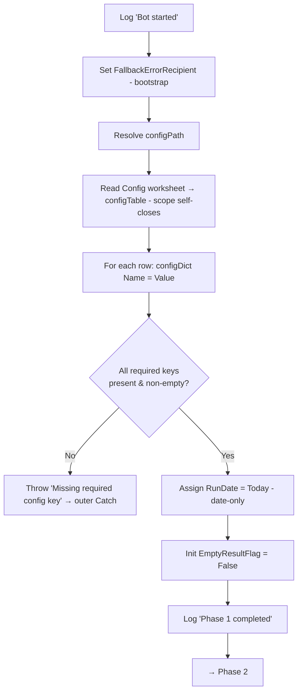
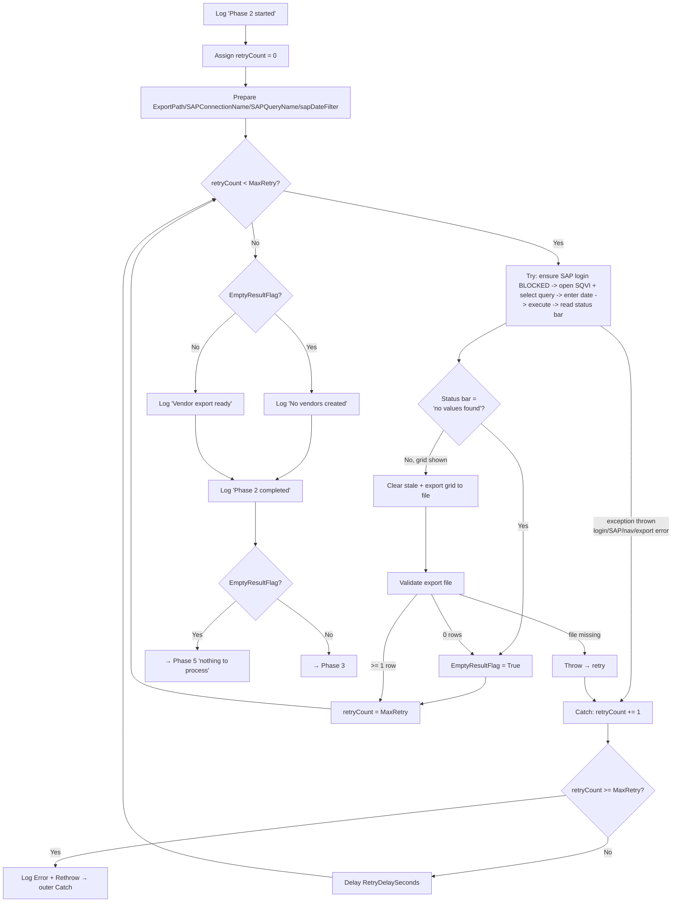
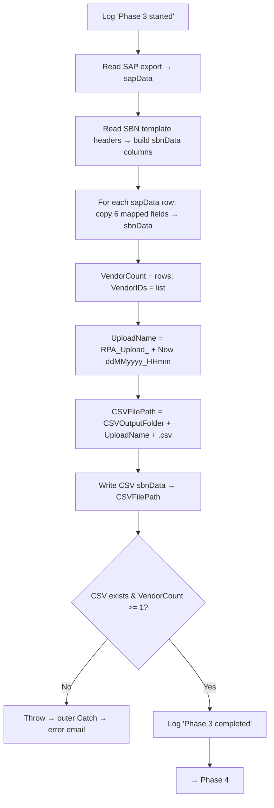

# Medium-Level Design — Daily Vendor SBN Upload Bot

**Platform:** UiPath (see `uipath-reference.md` for rules). **Status:** Medium-level design in progress — **Phase 1/6 confirmed; Phases 2/6 (revised SE16N→SQVI) and 3/6 awaiting user confirmation; Phases 4/6–6/6 not yet drafted.** Designed one logical phase at a time.

Each section below designs one of the six phases from the confirmed high-level design: purpose/scope, key logical steps, variables/data structures, error handling, and an internal flow diagram. All six phases run inside `Main.xaml`, wrapped by the outer Try-Catch-Finally (reference P4).

---

## Phase 1/6 — Initialize & Read Config

**Status:** Confirmed by user.

### Purpose & scope
Prepare the run before any business work: begin logging, load `Config.xlsx` into `configDict`, validate that every required setting is present, and initialize the run-level variables the later phases depend on (run date, retry counter, empty-result flag). This phase touches no external application (SAP/SBN/Outlook not opened yet), so its only failure mode is a bad/missing config.

### Key logical steps
1. **Log "Bot started"** (Info) — process name + timestamp.
2. **Set the bootstrap fallback recipient** — `Assign FallbackErrorRecipient = "<admin/support address>"` **before** the config read, so an error email can be sent even if the config load itself fails (see Error handling). This and `configPath` are the only two bootstrap literals allowed (they can't live in Config — they precede/point to it).
3. **Resolve the Config path** — `configPath` from a known project-relative location (e.g. `.\Config.xlsx`).
4. **Read Config worksheet** — read the "Config" sheet (Name/Value) into `configTable` via a `Use Excel File` scope (reference P1); the scope self-closes on exit.
5. **Populate configDict** — for each row, `configDict(Name) = Value`.
6. **Validate required keys** — confirm every required key exists and is non-empty (list below). On any missing/blank key, raise a clear exception (→ outer Catch → error email).
7. **Compute run date** — `RunDate = Today` (date-only). Used **only** for the SQVI query's create-date filter in Phase 2 and the `ddMMyyyy` date portion of the upload name. The upload name's `HHmm` timestamp is taken from `Now` at Phase 3 (not from `RunDate`), so the name stays minute-unique per run.
8. **Initialize control variables** — `EmptyResultFlag = False`. (`retryCount` is Main-scoped but the operative reset is per-retry-block in Phase 2 per P2 — the value set here is not relied upon.)
9. **Log "Phase 1 completed"** (Info).

### Variables / data structures
| Name | Type | Scope | Initial | Purpose |
|---|---|---|---|---|
| `configPath` | String | Main | `.\Config.xlsx` | Location of Config workbook (bootstrap literal — the working dir must resolve to project root) |
| `FallbackErrorRecipient` | String | Main | `"<admin address>"` | Bootstrap literal — error-email recipient when `configDict` isn't populated |
| `configTable` | DataTable | Main | — | Raw Config sheet read |
| `configDict` | Dictionary(Of String, String) | Main | new | All settings, keyed by Name |
| `RunDate` | DateTime | Main | `Today` | Date-only — SQVI create-date filter + `ddMMyyyy` portion of upload name (NOT the `HHmm`) |
| `EmptyResultFlag` | Boolean | Main | `False` | Set true in Phase 2 if the SQVI query returns no rows |
| `retryCount` | Int32 | Main | `0` | Shared retry counter; operative reset is per-block in Phase 2 (reference P2) |

### Required Config keys (validated here; values are examples only, real values live in Config.xlsx)
| Key | Used by | Example |
|---|---|---|
| `ExportPath` | Phase 2/3 | `.\data\vendor_export.xlsx` |
| `SAPConnectionName` | Phase 2 | `PRD [connection string]` |
| `SAPQueryName` | Phase 2 | `Z_VENDOR_EMAIL` (SQVI query name) |
| `MaxRetry` | Phase 2 (P2) | `3` |
| `RetryDelaySeconds` | Phase 2 (P2) | `10` |
| `TemplatePath` | Phase 3 | `.\templates\SBN_template.csv` |
| `CSVOutputFolder` | Phase 3 | `.\output\` |
| `SBNUrl` | Phase 4 | `https://...ariba.com/...` |
| `PollIntervalSeconds` | Phase 4 | `5` |
| `PollTimeoutSeconds` | Phase 4 | `120` |
| `EmailRecipients` | Phase 5 | `team@company.com` |
| `EmailFrom` / mail settings | Phase 5 | (per chosen mail mechanism) |

*(Credential keys — SAP/SBN login — are deliberately out of scope until the login method is decided; see Open Items. They will be added to this list then, sourced from Config or a secure store per reference R7.)*

### Error handling
- **Config file missing / unreadable** → exception propagates to the outer Catch → log Error + error email. The `Use Excel File` scope self-closes on exception (reference ⚠️ U4 — unverified; fallback is an explicit close in Phase 6), so no app is left open for Finally.
- **A required key missing or blank** → step 6 raises a descriptive exception (`"Missing required config key: <name>"`) → same outer Catch path.
- **Bootstrap-safe error email** — because a config-load failure leaves `configDict` empty, the outer Catch's error email (designed in Phase 5) must **not** assume `configDict` is populated: it uses `configDict("EmailRecipients")` when present, else `FallbackErrorRecipient` (set in step 2). The chosen mail mechanism must likewise not depend on a config value that may be missing (e.g. Outlook desktop needs only a recipient). This dependency is recorded here and enforced in the Phase 5 design.
- No retry at this phase — a bad config won't fix itself on retry; fail fast with a clear message.

### Internal flow

---

## Phase 2/6 — Extract Vendors from SAP

**Status:** Awaiting re-confirmation (revised SE16N→SQVI). **Approach: native UiPath SAP UI automation** (screen-by-screen, revised from the earlier `.vbs` approach — see PDD "SAP Extraction Approach"). **SAP login sub-step is BLOCKED** pending the credential/login-method decision (Open Item #2) — structure designed, mechanism deferred with fallbacks.

### Purpose & scope
Establish a logged-in SAP session, drive **SQVI** with UI activities to run the pre-built query (LFA1 ⋈ ADRC, so email is included) for vendors created on `RunDate`, detect the empty-day case by reading the SAP status bar, export the grid to a file, and hand a validated export file to Phase 3 — all under retry so a transient SAP hiccup doesn't fail the run. Both "records exported" and "no values found" are **successful** outcomes of this phase; only technical failure (SAP won't open, login fails, navigation/export error) is an error, and after `MaxRetry` it propagates to the outer Catch (→ error email; Finally closes SAP).

**Prerequisite:** the SQVI query (`SAPQueryName`) must exist and be runnable by the bot's SAP user (SQVI queries are user-specific — see PDD Prerequisites). If the query is not found for the login user, this phase fails on navigation → error email.

### How empty vs. failure is told apart
Distinguishing "empty day" from "SAP failure" is the crux of this phase, and native automation makes it a **direct read**: after Execute, UiPath reads the SAP **status bar** (reference P5, ⚠️ U2). If it shows the "no values were found" message → empty day (success). If the result grid is shown → export and proceed. Any exception during login/navigation/execute/export is a technical failure → retry. **Fallback (if the status-bar read proves unreliable at build):** switch to an always-export-then-count model — attempt the export unconditionally and treat a zero-row / no-export result as the empty case (U2). Note this changes the empty branch to route through the export+row-count path rather than skipping export.

### Key logical steps
1. **Log "Phase 2 started"** (Info).
2. **Reset retry counter** — `Assign retryCount = 0` (P2; the operative reset for this block).
3. **Prepare inputs** — read `ExportPath`, `SAPConnectionName`, `SAPQueryName`, `MaxRetry`, `RetryDelaySeconds` from `configDict`; build `sapDateFilter` = `RunDate` formatted to the SAP display format (⚠️ U5).
4. **Retry block** — `Do While retryCount < CInt(configDict("MaxRetry"))` wrapping a `Try Catch`:
   - **Try:**
     1. **Ensure logged-in SAP session** for `SAPConnectionName`. **[BLOCKED — credential source + login mechanism TBC]** — placeholder: open SAP Logon if not running, connect to the system, supply credentials from the chosen secure source, confirm the session is ready. Fallbacks under consideration: UiPath SAP login activities, or SSO.
     2. **Open SQVI and select the query** — `Type Into` the SAP command field with the transaction code and confirm (P5); in SQVI, select the query named `SAPQueryName` and execute it to reach its selection screen (⚠️ U9 — exact SQVI navigation/selection to confirm live; fallback: run the query's generated program directly, or use a global InfoSet query the bot user can access). If the query isn't present for the login user, this throws → treated as a failure (surfaces the user-specific-query prerequisite).
     3. **Enter the filter** — enter the create-date criterion `sapDateFilter` into the query's create-date (ERDAT) selection parameter (⚠️ U5 for the date format).
     4. **Execute** — `Click` Execute / send `F8`; wait for either the result grid or a status-bar message.
     5. **Read the status bar** — `Assign statusBarText = <Get Text of the SAP status bar>` (P5, ⚠️ U2).
     6. **Decide empty vs. records:**
        - `statusBarText` indicates **"no values were found"** → `Assign EmptyResultFlag = True`.
        - else (**result grid shown**):
          a. **Clear stale export** — delete any previous-run `ExportPath` so a leftover file can't be mistaken for this run's output.
          b. **Export the grid** to `ExportPath` via System → List → Export → Spreadsheet, driven by UI activities (⚠️ U7).
          c. **Validate `ExportPath`:** file **missing** → **Throw** `"SAP export file not produced"` → retry; file with **≥1 data row** → proceed (records found); file with **0 rows** (contradicts a non-empty grid) → fall back to the empty path (`Assign EmptyResultFlag = True`) + log a Warning (U2).
     7. **Exit the loop on success** — `Assign retryCount = CInt(configDict("MaxRetry"))` (both empty and records are success).
   - **Catch ex:**
     1. `Assign retryCount = retryCount + 1`.
     2. If `retryCount >= CInt(configDict("MaxRetry"))` → `Log Message (Error)` with `ex.Message` + **Rethrow** (→ outer Catch → error email).
     3. Else → `Delay` `RetryDelaySeconds`, then loop (the login/navigation steps re-run, recovering from a dropped session).
5. **Branch on outcome:**
   - `EmptyResultFlag = True` → Log "No vendors created on <RunDate>" (Info) → route to **Phase 5** ("nothing to process" email), skipping Phases 3–4.
   - else → Log "Vendor export ready" (Info) → continue to **Phase 3**.
6. **Log "Phase 2 completed"** (Info).

### Variables / data structures
| Name | Type | Scope | Initial | Purpose |
|---|---|---|---|---|
| `sapDateFilter` | String | Main | — | `RunDate` in SAP display format (⚠️ U5) for the ERDAT filter |
| `statusBarText` | String | Main | — | SAP status-bar text read after executing the SQVI query (⚠️ U2), tested for the no-records message |
| `retryCount` | Int32 | Main | reset to 0 here | Retry counter for this block (P2) |
| `EmptyResultFlag` | Boolean | Main | (from Phase 1) | Set True here on no-records / zero-row; consumed in step 5 + Phase 5 |

Consumes from Phase 1: `RunDate`, `configDict`, `retryCount`, `EmptyResultFlag`. Produces for Phase 3: a validated `ExportPath` file with ≥1 vendor row. Produces for Phase 5 (empty branch): `EmptyResultFlag`, `RunDate`.

### Error handling
- **SAP won't open / login fails / navigation or export error / export file missing** → caught in the retry block; retried up to `MaxRetry` with a `RetryDelaySeconds` delay; on final failure logged (Error) and **Rethrown** to the outer Catch → error email; Finally (Phase 6) closes SAP.
- **Empty day (status bar "no values found")** → not an error; sets `EmptyResultFlag` and routes to Phase 5.
- **Login is BLOCKED** — the exact credential retrieval and login mechanism is deferred (Open Item #2). The retry/exception structure around it is designed and won't change when the mechanism is chosen; only step 4.Try.1 gets filled in.

### Internal flow

---

## Phase 3/6 — Map Data to SBN Template

**Status:** Awaiting user confirmation. Reached only when Phase 2 found records (`EmptyResultFlag = False`).

### Purpose & scope
Turn the SAP export into the upload artifact: read the exported vendor rows, produce a CSV that exactly matches the **SBN-fixed template** (headers + order), copy the six fields across unchanged, generate the **minute-unique upload name once**, capture the **vendor count and IDs** for the summary email, and save the dated CSV for Phase 4. No transformation and no business validation of values — blanks pass through and, if SBN rejects them, that surfaces as "Errors Found" in Phase 4 (reported, not pre-checked).

### Mapping approach (template-driven)
The output CSV's columns come **from the SBN template file**, not hardcoded: read the template's header row and build the output structure from it, so the file always matches whatever SBN currently expects (the SBN page also offers "Download latest template version"). Refreshing `TemplatePath` handles **reordered or renamed** headers automatically; a genuinely **new required SBN column** also needs a new source↔target mapping added below (the pairs are still per-name). Each mapped SBN column is filled from its **SQVI query output column** — a **straight copy**.

The exact source↔target column pairs are **TBC** (Open Items #3 SBN headers, #4 SQVI query output columns):

| SBN column (from template) | SQVI output column (underlying field) | Note |
|---|---|---|
| Vendor Name | `NAME1` (LFA1) (TBC) | direct copy |
| Vendor ID | `LIFNR` (LFA1) (TBC) | direct copy |
| Tax ID | `STCD1` (LFA1) (TBC) | direct copy — confirm which tax field (STCD1 vs STCEG/VAT) |
| City | `ORT01` (LFA1) (TBC) | direct copy |
| Country | `LAND1` (LFA1) (TBC) | direct copy — confirm SBN wants code vs. name (PDD says no transformation, so template presumably takes the code) |
| Email | `SMTP_ADDR` (ADRC) (TBC) | direct copy — resolved via the SQVI LFA1 ⋈ ADRC join (LFA1.ADRNR → ADRC.ADDRNUMBER) |

*(Column names above are placeholders to be replaced from the real SBN template + a sample SQVI export. Note: a vendor with multiple ADRC email rows could fan out to >1 row per vendor — confirm the query returns one row per vendor.)*

### Key logical steps
1. **Log "Phase 3 started"** (Info).
2. **Read the SAP export** — `Read Range` inside a `Use Excel File` scope on `ExportPath` (an `.xlsx` Spreadsheet export) → `sapData` (DataTable). (Already validated non-empty in Phase 2.) The scope self-closes on exit (⚠️ U4; stray-Excel fallback in Phase 6).
3. **Read the SBN template headers** — read `TemplatePath`'s header row → build `sbnData` (DataTable) with those columns, in template order.
4. **Map rows** — `For Each Row` in `sapData`: create an `sbnData` row, assign each SBN column from its mapped `sapData` source column (straight copy per the mapping table). Add to `sbnData`.
5. **Capture email facts** — `VendorCount = sapData.Rows.Count`; `VendorIDs` = the list of Vendor ID values (for the Phase 5 email).
6. **Generate the upload name (once)** — `UploadName = "RPA_Upload_" + Now.ToString("ddMMyyyy_HHmm")`. Used for both the CSV filename and the Phase 4 SBN upload Name (single source, can't diverge).
7. **Build the CSV path** — `CSVFilePath = Path.Combine(configDict("CSVOutputFolder"), UploadName + ".csv")`.
8. **Write the CSV** — `Write CSV` `sbnData` → `CSVFilePath`, with the SBN-required delimiter/encoding (⚠️ U8 — confirm comma + encoding/quoting against a known-good SBN file; fallback: match the byte format — delimiter, encoding, line endings — of a manually-exported working SBN file exactly).
9. **Validate output** — confirm `CSVFilePath` exists; `VendorCount ≥ 1`.
10. **Log "Phase 3 completed"** (Info) → continue to **Phase 4**.

### Variables / data structures
| Name | Type | Scope | Initial | Purpose |
|---|---|---|---|---|
| `sapData` | DataTable | Main | — | Rows read from the SAP export |
| `sbnData` | DataTable | Main | — | Output table, columns built from the SBN template |
| `VendorCount` | Int32 | Main | — | Row count — for the Phase 5 email + output validation |
| `VendorIDs` | List(Of String) | Main | — | Vendor ID list — for the Phase 5 email |
| `UploadName` | String | Main | — | `RPA_Upload_ddMMyyyy_HHmm`, generated once; reused as CSV filename + SBN upload Name |
| `CSVFilePath` | String | Main | — | Full path of the saved dated CSV |

Consumes from earlier phases: `configDict` (`ExportPath`, `TemplatePath`, `CSVOutputFolder`), a validated `ExportPath` file. Produces for Phase 4: `CSVFilePath`, `UploadName`. Produces for Phase 5: `VendorCount`, `VendorIDs`, `UploadName`, `CSVFilePath` (attachment).

### Error handling
- No dedicated retry — mapping is deterministic; a failure (export unreadable/locked, template missing, a mapped source column not found, CSV write fails) is **not** self-healing, so it propagates to the outer Catch → error email; Finally (Phase 6) cleans up. A missing mapped source column throws a descriptive error (`"Expected source column <name> not found in SAP export"`).
- **No value validation** — per the PDD there are no business rules; blank/edge values are copied as-is and any SBN rejection is captured as "Errors Found" in Phase 4.

### Internal flow

