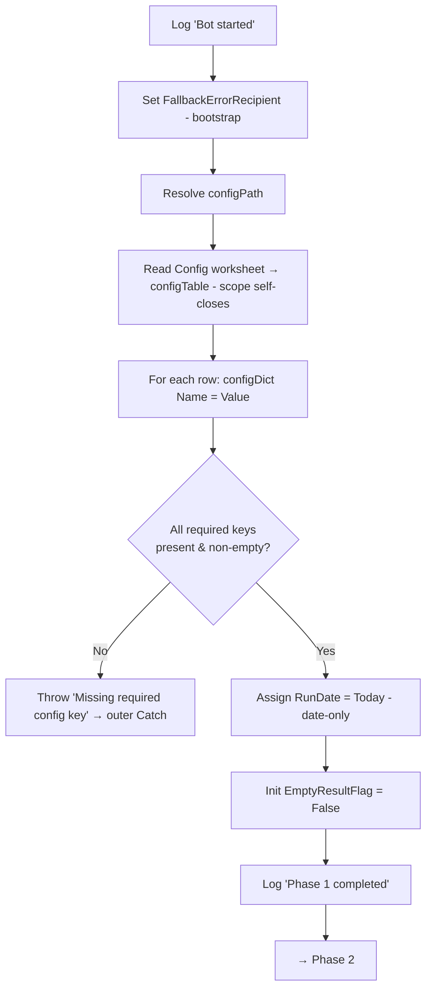

# Medium-Level Design — Daily Vendor SBN Upload Bot

**Platform:** UiPath (see `uipath-reference.md` for rules). **Status:** Medium-level design in progress — **Phase 1/6 designed (awaiting user confirmation); Phases 2/6–6/6 not yet drafted.** Designed one logical phase at a time.

Each section below designs one of the six phases from the confirmed high-level design: purpose/scope, key logical steps, variables/data structures, error handling, and an internal flow diagram. All six phases run inside `Main.xaml`, wrapped by the outer Try-Catch-Finally (reference P4).

---

## Phase 1/6 — Initialize & Read Config

**Status:** Awaiting user confirmation.

### Purpose & scope
Prepare the run before any business work: begin logging, load `Config.xlsx` into `configDict`, validate that every required setting is present, and initialize the run-level variables the later phases depend on (run date, retry counter, empty-result flag). This phase touches no external application (SAP/SBN/Outlook not opened yet), so its only failure mode is a bad/missing config.

### Key logical steps
1. **Log "Bot started"** (Info) — process name + timestamp.
2. **Set the bootstrap fallback recipient** — `Assign FallbackErrorRecipient = "<admin/support address>"` **before** the config read, so an error email can be sent even if the config load itself fails (see Error handling). This and `configPath` are the only two bootstrap literals allowed (they can't live in Config — they precede/point to it).
3. **Resolve the Config path** — `configPath` from a known project-relative location (e.g. `.\Config.xlsx`).
4. **Read Config worksheet** — read the "Config" sheet (Name/Value) into `configTable` via a `Use Excel File` scope (reference P1); the scope self-closes on exit.
5. **Populate configDict** — for each row, `configDict(Name) = Value`.
6. **Validate required keys** — confirm every required key exists and is non-empty (list below). On any missing/blank key, raise a clear exception (→ outer Catch → error email).
7. **Compute run date** — `RunDate = Today` (date-only). Used **only** for the SE16N create-date filter in Phase 2 and the `ddMMyyyy` date portion of the upload name. The upload name's `HHmm` timestamp is taken from `Now` at Phase 3 (not from `RunDate`), so the name stays minute-unique per run.
8. **Initialize control variables** — `EmptyResultFlag = False`. (`retryCount` is Main-scoped but the operative reset is per-retry-block in Phase 2 per P2 — the value set here is not relied upon.)
9. **Log "Phase 1 completed"** (Info).

### Variables / data structures
| Name | Type | Scope | Initial | Purpose |
|---|---|---|---|---|
| `configPath` | String | Main | `.\Config.xlsx` | Location of Config workbook (bootstrap literal — the working dir must resolve to project root) |
| `FallbackErrorRecipient` | String | Main | `"<admin address>"` | Bootstrap literal — error-email recipient when `configDict` isn't populated |
| `configTable` | DataTable | Main | — | Raw Config sheet read |
| `configDict` | Dictionary(Of String, String) | Main | new | All settings, keyed by Name |
| `RunDate` | DateTime | Main | `Today` | Date-only — SE16N create-date filter + `ddMMyyyy` portion of upload name (NOT the `HHmm`) |
| `EmptyResultFlag` | Boolean | Main | `False` | Set true in Phase 2 if SE16N returns no rows |
| `retryCount` | Int32 | Main | `0` | Shared retry counter; operative reset is per-block in Phase 2 (reference P2) |

### Required Config keys (validated here; values are examples only, real values live in Config.xlsx)
| Key | Used by | Example |
|---|---|---|
| `VBSPath` | Phase 2 | `.\scripts\extract_lfa1.vbs` |
| `ExportPath` | Phase 2/3 | `.\data\lfa1_export.xlsx` |
| `TemplatePath` | Phase 3 | `.\templates\SBN_template.csv` |
| `CSVOutputFolder` | Phase 3 | `.\output\` |
| `SBNUrl` | Phase 4 | `https://...ariba.com/...` |
| `MaxRetry` | Phase 2 (P2) | `3` |
| `PollIntervalSeconds` | Phase 4 | `5` |
| `PollTimeoutSeconds` | Phase 4 | `120` |
| `EmailRecipients` | Phase 5 | `team@company.com` |
| `EmailFrom` / mail settings | Phase 5 | (per chosen mail mechanism) |

*(Credential keys — SAP/SBN login — are deliberately out of scope until the login method is decided; see Open Items. They will be added to this list then, sourced from Config or a secure store per reference R7.)*

### Error handling
- **Config file missing / unreadable** → exception propagates to the outer Catch → log Error + error email. The `Use Excel File` scope self-closes on exception (reference ⚠️ U4 — unverified; fallback is an explicit close in Phase 6), so no app is left open for Finally.
- **A required key missing or blank** → step 6 raises a descriptive exception (`"Missing required config key: <name>"`) → same outer Catch path.
- **Bootstrap-safe error email** — because a config-load failure leaves `configDict` empty, the outer Catch's error email (designed in Phase 5) must **not** assume `configDict` is populated: it uses `configDict("EmailRecipients")` when present, else `FallbackErrorRecipient` (set in step 2). The chosen mail mechanism must likewise not depend on a config value that may be missing (e.g. Outlook desktop needs only a recipient). This dependency is recorded here and enforced in the Phase 5 design.
- No retry at this phase — a bad config won't fix itself on retry; fail fast with a clear message.

### Internal flow

