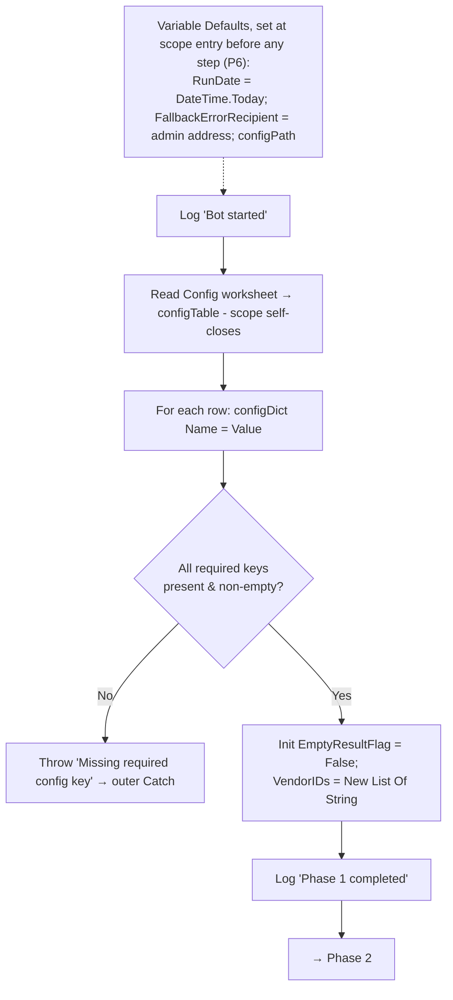
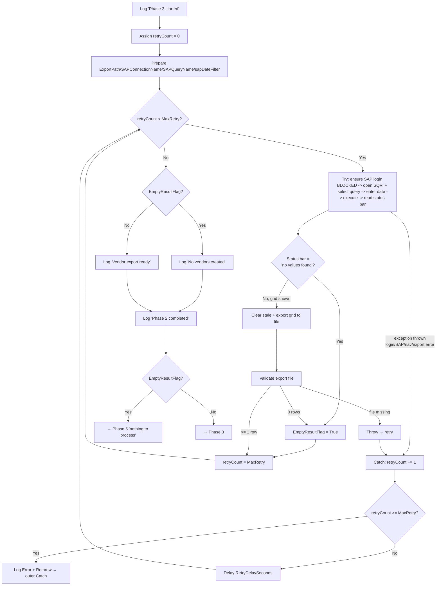
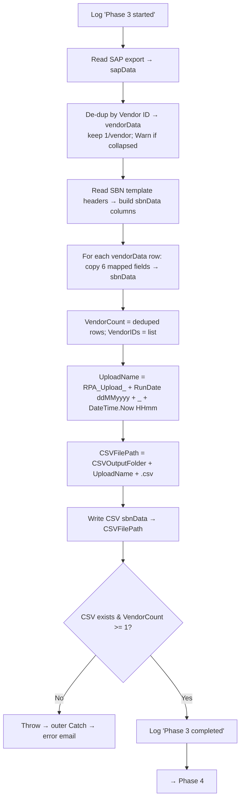

# Medium-Level Design — Daily Vendor SBN Upload Bot

**Platform:** UiPath (see `uipath-reference.md` for rules). **Status:** Medium-level design in progress — **Phase 1/6 confirmed; Phases 2/6 (revised SE16N→SQVI) and 3/6 awaiting user confirmation; Phases 4/6–6/6 not yet drafted.** Designed one logical phase at a time.

Each section below designs one of the six phases from the confirmed high-level design: purpose/scope, key logical steps, variables/data structures, error handling, and an internal flow diagram. All six phases run inside `Main.xaml`, wrapped by the outer Try-Catch-Finally (reference P4).

---

## Phase 1/6 — Initialize & Read Config

**Status:** Confirmed by user.

### Purpose & scope
Prepare the run before any business work: begin logging, load `Config.xlsx` into `configDict`, validate that every required setting is present, and initialize the run-level variables the later phases depend on (run date, retry counter, empty-result flag). This phase touches no external application (SAP/SBN/Outlook not opened yet), so its only failure mode is a bad/missing config.

### Key logical steps
1. **Log "Bot started"** (Info) — process name + timestamp.
2. **Bootstrap fallback recipient** — `FallbackErrorRecipient` carries a **variable Default** of `"<admin address>"`, not a step `Assign`, so an error email can be sent even if the config load itself fails (see Error handling). Per **P6**: the outer Catch reads it, so it must be valid at scope entry — a step `Assign` would be safe only as long as nothing is ever inserted ahead of it, which is exactly the kind of assumption that breaks silently when a prologue step is added later. This and `configPath` are the only two bootstrap literals allowed (they can't live in Config — they precede/point to it).
3. **Config path** — `configPath` carries a variable **Default** of `"Config.xlsx"` (bootstrap literal, no step), resolved against the working directory, which must be the project root. Nothing reads it before step 4, so P6 doesn't force the Default here — it's a Default because it's a constant, not because of the error path. (Written without a `.\` prefix so the literal is valid in both VB and C# expression projects, per R6. ⚠️ **U11** — that a bare relative path resolves against the project folder is unconfirmed for an Orchestrator-deployed run; the fallback is an **absolute path supplied from outside the workflow** (a Main `in_ConfigPath` argument fed by an Orchestrator process setting, or an asset), *not* a `Directory.GetCurrentDirectory()` combine, which resolves to the same place the bare literal does.)
4. **Read Config worksheet** — read the "Config" sheet (Name/Value) from the workbook at `configPath` into `configTable` via a `Use Excel File` scope (reference P1); the scope self-closes on exit. This is the only reader of `configPath` in the design — Phases 4–6, when drafted, consume `configDict` and must not re-open the workbook.
5. **Populate configDict** — for each row, `configDict(Name) = Value`.
6. **Validate required keys** — confirm every required key exists and is non-empty (list below). On any missing/blank key, raise a clear exception (→ outer Catch → error email).
7. **Run date (P6)** — `RunDate` is **not assigned by a step**; it carries the variable **Default `DateTime.Today`**, which UiPath evaluates at scope entry, before any step can throw. That's deliberate: step 6 can throw on a bad config, and the outer Catch's error email needs a valid date. An assign placed here would leave `RunDate` at `DateTime.MinValue` (01/01/0001) on exactly that path. Date-only. Consumers: the SQVI create-date filter (Phase 2), the `ddMMyyyy` portion of the upload name (Phase 3), the "No vendors created on \<RunDate\>" log and empty-day email (Phases 2/5), and the Catch-path error email — that last one is why it must be a Default rather than a step assign. The upload name's `HHmm` comes from `DateTime.Now` at Phase 3, so the name stays minute-unique per run.
8. **Initialize control variables (step `Assign`, per P6 — neither is read on the error path)** — `EmptyResultFlag = False`; `VendorIDs = New List(Of String)`. `VendorIDs` is populated in Phase 3, but the empty-day path skips Phase 3 and still reaches Phase 5's "nothing to process" email — an uninitialized `List` is `Nothing`, so it must be created here rather than where it's filled. (`VendorCount` is `Int32` and defaults to 0, so it needs no explicit init.) (`retryCount` is **not** assigned here — it's Main-scoped and left at its `Int32` default of 0; the operative reset is per-retry-block in Phase 2, per P2.)
9. **Log "Phase 1 completed"** (Info).

### Variables / data structures
| Name | Type | Scope | Initial | Purpose |
|---|---|---|---|---|
| `configPath` | String | Main | **Default** `"Config.xlsx"` | Location of Config workbook (bootstrap literal — the working dir must resolve to project root, ⚠️ **U11**) |
| `FallbackErrorRecipient` | String | Main | **Default** `"<admin address>"` (P6 — read by the Catch-path email) | Bootstrap literal — error-email recipient when `configDict` isn't populated |
| `configTable` | DataTable | Main | activity output (step 4) | Raw Config sheet read |
| `configDict` | Dictionary(Of String, String) | Main | **Default** `New Dictionary(Of String, String)` | All settings, keyed by Name |
| `RunDate` | DateTime | Main | variable **Default** `DateTime.Today` (evaluated at scope entry, not by a step — see step 7; `DateTime.Today` rather than VB's `Today` so the expression works in C# projects too, per R6) | Date-only — SQVI create-date filter + `ddMMyyyy` portion of upload name (NOT the `HHmm`) |
| `EmptyResultFlag` | Boolean | Main | `False` — **step Assign (step 8)** | Set true in Phase 2 if the SQVI query returns no rows |
| `VendorIDs` | List(Of String) | Main | `New List(Of String)` — **step Assign (step 8)** | Populated in Phase 3; created **here** because the empty-day path skips Phase 3 and Phase 5 still reads it |
| `retryCount` | Int32 | Main | `0` (Int32 default) — **step Assign** per retry block | Shared retry counter; operative reset is per-block in Phase 2 (reference P2) |

### Required Config keys (validated here; values are examples only, real values live in Config.xlsx)
| Key | Used by | Example |
|---|---|---|
| `ExportPath` | Phase 2/3 | `.\data\vendor_export.xlsx` |
| `SAPConnectionName` | Phase 2 | `PRD [connection string]` |
| `SAPQueryName` | Phase 2 | `Z_VENDOR_EMAIL` (SQVI query name) |
| `MaxRetry` | Phase 2 (P2) | `3` |
| `RetryDelaySeconds` | Phase 2 (P2) | `10` |
| `TemplatePath` | Phase 3 | `.\templates\SBN_template.csv` |
| `CSVOutputFolder` | Phase 3 | `.\output\` |
| `SBNUrl` | Phase 4 | `https://...ariba.com/...` |
| `PollIntervalSeconds` | Phase 4 | `5` |
| `PollTimeoutSeconds` | Phase 4 | `120` |
| `EmailRecipients` | Phase 5 | `team@company.com` |
| `EmailFrom` / mail settings | Phase 5 | (per chosen mail mechanism) |

*(Credential keys — SAP/SBN login — are deliberately out of scope until the login method is decided; see Open Items. They will be added to this list then, sourced from Config or a secure store per reference R7.)*

### Error handling
- **Config file missing / unreadable** → exception propagates to the outer Catch → log Error + error email. The `Use Excel File` scope self-closes on exception (reference ⚠️ U4 — unverified; fallback is an explicit close in Phase 6), so no app is left open for Finally.
- **A required key missing or blank** → step 6 raises a descriptive exception (`"Missing required config key: <name>"`) → same outer Catch path.
- **Bootstrap-safe error email** — because a config-load failure leaves `configDict` empty, the outer Catch's error email (designed in Phase 5) must **not** assume `configDict` is populated: it uses `configDict("EmailRecipients")` when present, else `FallbackErrorRecipient` (variable **Default**, evaluated at scope entry — see step 2 and P6). The chosen mail mechanism must likewise not depend on a config value that may be missing (e.g. Outlook desktop needs only a recipient). This dependency is recorded here and enforced in the Phase 5 design.
- **The error email must not read *any* later-phase variable.** Step 6's throw fires **before** step 8's initializations, so on the missing-config-key path `VendorIDs` is still `Nothing` and `VendorCount` is 0 — and on a Phase-2 failure neither has been populated either. The Catch-path email carries only the exception message and the run date; vendor facts belong to the success and empty-day emails. Enforced in the Phase 5 design.
- No retry at this phase — a bad config won't fix itself on retry; fail fast with a clear message.

### Internal flow

```mermaid
graph TD
    S1[Log 'Bot started'] --> S4[Read Config worksheet → configTable - scope self-closes]
    S4 --> S5[For each row: configDict Name = Value]
    S5 --> S6{All required keys<br/>present & non-empty?}
    S6 -->|No| THROW[Throw 'Missing required config key' → outer Catch]
    S6 -->|Yes| S8[Init EmptyResultFlag = False;<br/>VendorIDs = New List Of String]
    S8 --> S9[Log 'Phase 1 completed'] --> NEXT[→ Phase 2]
    RD["Variable Defaults, set at scope entry before any step (P6):<br/>RunDate = DateTime.Today; FallbackErrorRecipient = admin address; configPath"] -.-> S1
```

---

## Phase 2/6 — Extract Vendors from SAP

**Status:** Awaiting re-confirmation (revised SE16N→SQVI). **Approach: native UiPath SAP UI automation** (screen-by-screen, revised from the earlier `.vbs` approach — see PDD "SAP Extraction Approach"). **SAP login sub-step is BLOCKED** pending the credential/login-method decision (Open Item #2) — structure designed, mechanism deferred with fallbacks.

### Purpose & scope
Establish a logged-in SAP session, drive **SQVI** with UI activities to run the pre-built query (LFA1 ⋈ ADRC ⋈ ADR6, so email is included) for vendors created on `RunDate`, detect the empty-day case by reading the SAP status bar, export the grid to a file, and hand a validated export file to Phase 3 — all under retry so a transient SAP hiccup doesn't fail the run. Both "records exported" and "no values found" are **successful** outcomes of this phase; only technical failure (SAP won't open, login fails, navigation/export error) is an error, and after `MaxRetry` it propagates to the outer Catch (→ error email; Finally closes SAP).

**Prerequisite:** the SQVI query (`SAPQueryName`) must exist and be runnable by the bot's SAP user (SQVI queries are user-specific — see PDD Prerequisites). If the query is not found for the login user, this phase fails on navigation → error email.

### How empty vs. failure is told apart
Distinguishing "empty day" from "SAP failure" is the crux of this phase, and native automation makes it a **direct read**: after Execute, UiPath reads the SAP **status bar** (reference P5, ⚠️ U2). If it shows the "no values were found" message → empty day (success). If the result grid is shown → export and proceed. Any exception during login/navigation/execute/export is a technical failure → retry. **Fallback (if the status-bar read proves unreliable at build):** switch to an always-export-then-count model — attempt the export unconditionally and treat a zero-row / no-export result as the empty case (U2). Note this changes the empty branch to route through the export+row-count path rather than skipping export.

### Key logical steps
1. **Log "Phase 2 started"** (Info).
2. **Reset retry counter** — `Assign retryCount = 0` (P2; the operative reset for this block).
3. **Prepare inputs** — read `ExportPath`, `SAPConnectionName`, `SAPQueryName`, `MaxRetry`, `RetryDelaySeconds` from `configDict`; build `sapDateFilter` = `RunDate` formatted to the SAP display format (⚠️ U5).
4. **Retry block** — `Do While retryCount < CInt(configDict("MaxRetry"))` wrapping a `Try Catch`:
   - **Try:**
     1. **Ensure logged-in SAP session** for `SAPConnectionName`. **[BLOCKED — credential source + login mechanism TBC]** — placeholder: open SAP Logon if not running, connect to the system, supply credentials from the chosen secure source, confirm the session is ready. Fallbacks under consideration: UiPath SAP login activities, or SSO.
     2. **Open SQVI and select the query** — `Type Into` the SAP command field with the transaction code and confirm (P5); in SQVI, select the query named `SAPQueryName` and execute it to reach its selection screen (⚠️ U9 — exact SQVI navigation/selection to confirm live; fallback: run the query's generated program directly, or use a global InfoSet query the bot user can access). If the query isn't present for the login user, this throws → treated as a failure (surfaces the user-specific-query prerequisite).
     3. **Enter the filter** — enter the create-date criterion `sapDateFilter` into the query's create-date (ERDAT) selection parameter (⚠️ U5 for the date format).
     4. **Execute** — `Click` Execute / send `F8`; wait for either the result grid or a status-bar message.
     5. **Read the status bar** — `Assign statusBarText = <Get Text of the SAP status bar>` (P5, ⚠️ U2).
     6. **Decide empty vs. records:**
        - `statusBarText` indicates **"no values were found"** → `Assign EmptyResultFlag = True`.
        - else (**result grid shown**):
          a. **Clear stale export** — delete any previous-run `ExportPath` so a leftover file can't be mistaken for this run's output.
          b. **Export the grid** to `ExportPath` via System → List → Export → Spreadsheet, driven by UI activities (⚠️ U7).
          c. **Validate `ExportPath`:** file **missing** → **Throw** `"SAP export file not produced"` → retry; file with **≥1 data row** → proceed (records found — note this counts *rows*, not vendors: with L1 open a 1-vendor day arrives as 2 rows, which is harmless for this ≥1 check but means the count must never be reported as a vendor count); file with **0 rows** (contradicts a non-empty grid) → fall back to the empty path (`Assign EmptyResultFlag = True`) + log a Warning (U2, ⚠️ **U10** — the row count depends on the export's actual shape, and it can be wrong in both directions: an export with **no header row** has its only data row consumed as the header, so a 1-vendor day counts zero and routes to the "nothing to process" email without failing the run (only a Warning is logged); **preamble rows** miscount the other way, passing a garbage row through to Phase 3).
     7. **Exit the loop on success** — `Assign retryCount = CInt(configDict("MaxRetry"))` (both empty and records are success).
   - **Catch ex:**
     1. `Assign retryCount = retryCount + 1`.
     2. If `retryCount >= CInt(configDict("MaxRetry"))` → `Log Message (Error)` with `ex.Message` + **Rethrow** (→ outer Catch → error email).
     3. Else → `Delay` `RetryDelaySeconds`, then loop (the login/navigation steps re-run, recovering from a dropped session).
5. **Branch on outcome:**
   - `EmptyResultFlag = True` → Log "No vendors created on <RunDate>" (Info) → route to **Phase 5** ("nothing to process" email), skipping Phases 3–4.
   - else → Log "Vendor export ready" (Info) → continue to **Phase 3**.
6. **Log "Phase 2 completed"** (Info).

### Variables / data structures
| Name | Type | Scope | Initial | Purpose |
|---|---|---|---|---|
| `sapDateFilter` | String | Main | — | `RunDate` in SAP display format (⚠️ U5) for the ERDAT filter |
| `statusBarText` | String | Main | — | SAP status-bar text read after executing the SQVI query (⚠️ U2), tested for the no-records message |
| `retryCount` | Int32 | Main | reset to 0 here | Retry counter for this block (P2) |
| `EmptyResultFlag` | Boolean | Main | (from Phase 1) | Set True here on no-records / zero-row; consumed in step 5 + Phase 5 |

Consumes from Phase 1: `RunDate`, `configDict`, `retryCount`, `EmptyResultFlag`. Produces for Phase 3: a validated `ExportPath` file with ≥1 **data row** (rows ≠ vendors while L1 is open — see Phase 3 step 3). Produces for Phase 5 (empty branch): `EmptyResultFlag`, `RunDate`.

### Error handling
- **SAP won't open / login fails / navigation or export error / export file missing** → caught in the retry block; retried up to `MaxRetry` with a `RetryDelaySeconds` delay; on final failure logged (Error) and **Rethrown** to the outer Catch → error email; Finally (Phase 6) closes SAP.
- **Empty day (status bar "no values found")** → not an error; sets `EmptyResultFlag` and routes to Phase 5.
- **Login is BLOCKED** — the exact credential retrieval and login mechanism is deferred (Open Item #2). The retry/exception structure around it is designed and won't change when the mechanism is chosen; only step 4.Try.1 gets filled in.

### Internal flow

```mermaid
graph TD
    P1[Log 'Phase 2 started'] --> RST[Assign retryCount = 0]
    RST --> PREP[Prepare ExportPath/SAPConnectionName/SAPQueryName/sapDateFilter]
    PREP --> LOOP{retryCount < MaxRetry?}
    LOOP -->|No| DONE
    LOOP -->|Yes| TRY[Try: ensure SAP login BLOCKED -> open SQVI + select query -> enter date -> execute -> read status bar]
    TRY -->|exception thrown<br/>login/SAP/nav/export error| CATCH
    TRY --> STAT{Status bar =<br/>'no values found'?}
    STAT -->|Yes| EMPTY[EmptyResultFlag = True] --> EXIT[retryCount = MaxRetry]
    STAT -->|No, grid shown| EXP[Clear stale + export grid to file]
    EXP --> VAL[Validate export file]
    VAL -->|file missing| THROWN[Throw → retry]
    VAL -->|>= 1 row| EXIT
    VAL -->|0 rows| EMPTY
    THROWN --> CATCH[Catch: retryCount += 1]
    CATCH --> LAST{retryCount >= MaxRetry?}
    LAST -->|Yes| RETHROW[Log Error + Rethrow → outer Catch]
    LAST -->|No| DELAY[Delay RetryDelaySeconds] --> LOOP
    EXIT --> LOOP
    DONE{EmptyResultFlag?}
    DONE -->|Yes| LOGE[Log 'No vendors created'] --> CMP[Log 'Phase 2 completed']
    DONE -->|No| LOGR[Log 'Vendor export ready'] --> CMP
    CMP --> TOP{EmptyResultFlag?}
    TOP -->|Yes| TOP5[→ Phase 5 'nothing to process']
    TOP -->|No| TOP3[→ Phase 3]
```

---

## Phase 3/6 — Map Data to SBN Template

**Status:** Awaiting user confirmation. Reached only when Phase 2 found records (`EmptyResultFlag = False`).

### Purpose & scope
Turn the SAP export into the upload artifact: read the exported vendor rows, produce a CSV that exactly matches the **SBN-fixed template** (headers + order), copy the six fields across unchanged, generate the **minute-unique upload name once**, capture the **vendor count and IDs** for the summary email, and save the dated CSV for Phase 4. No transformation and no business validation of values — blanks pass through and, if SBN rejects them, that surfaces as "Errors Found" in Phase 4 (reported, not pre-checked).

### Mapping approach (template-driven)
The output CSV's columns come **from the SBN template file**, not hardcoded: read the template's header row and build the output structure from it, so the file always matches whatever SBN currently expects (the SBN page also offers "Download latest template version"). Refreshing `TemplatePath` handles **reordered or renamed** headers automatically; a genuinely **new required SBN column** also needs a new source↔target mapping added below (the pairs are still per-name). Each mapped SBN column is filled from its **SQVI query output column** — a **straight copy**.

The exact source↔target column pairs are **TBC** (Open Items #3 SBN headers, #4 SQVI query output columns):

| SBN column (from template) | SQVI output column (underlying field) | Note |
|---|---|---|
| Vendor Name | `NAME1` (LFA1) (TBC) | direct copy |
| Vendor ID | `LIFNR` (LFA1) (TBC) | direct copy |
| Tax ID | `STCD1` (LFA1) (TBC) | direct copy — confirm which tax field (STCD1 vs STCEG/VAT) |
| City | `ORT01` (LFA1) (TBC) | direct copy |
| Country | `LAND1` (LFA1) (TBC) | direct copy — confirm SBN wants code vs. name (PDD says no transformation, so template presumably takes the code) |
| Email | `SMTP_ADDR` (ADR6, `FLGDEFAULT='X'`) (TBC) | intended as one email per vendor via the query's **default-email filter** (⚠️ not achieved by the query as built — see **L1**); email lives in ADR6 (the SMTP table), joined `LFA1.ADRNR → ADR6.ADDRNUMBER` |

*(Column names above are placeholders to be replaced from the real SBN template + a sample SQVI export.)*

### Multi-email handling (one email per vendor)
Some vendors have **multiple emails** in ADR6, but SBN's file has a single email field. Resolution:
- **Primary (query-side):** the SQVI query filters email to SAP's **default/standard address** (`ADR6.FLGDEFAULT = 'X'`) to return the SAP-designated primary email. This was *designed* to yield **one row per vendor**; ⚠️ **a live run on 2026-08-14 disproved that for the query as built** — it returns 2 rows per vendor (`uipath-reference.md` **L1**). Whether the `FLGDEFAULT` filter is even present in the built query is one of the open questions in `PDD.md` Prerequisites (the ⚠️ OPEN bullet).
- **Join must be OUTER** so a vendor with **no default-flagged email** still comes through with a **blank** email rather than being dropped from the extract (an inner join would silently lose that vendor). A blank email is uploaded as-is and SBN reports it under "Errors Found" (surfaced in the Phase 5 email) — consistent with the no-pre-validation rule. *(These are query-design points for the built query — see PDD Prerequisites.)*
- **Bot-side de-dup — currently load-bearing, not a safety net:** Phase 3 **de-duplicates by Vendor ID** (step 3 below), keeping one row per vendor. It was designed as a guard against a stray duplicate; with L1 open it is the only thing preventing a CSV that uploads every vendor twice. See step 3.

### Key logical steps
1. **Log "Phase 3 started"** (Info).
2. **Read the SAP export** — `Read Range` inside a `Use Excel File` scope on `ExportPath` → `sapData` (DataTable). (Already validated non-empty in Phase 2.) The scope self-closes on exit (⚠️ U4; stray-Excel fallback in Phase 6). ⚠️ **U10** — this step assumes the export is an `.xlsx` with a clean header row in row 1; the format SAP actually produces, the header position, and any preamble rows are unconfirmed until a sample export is in hand. Fallback: `Read Range` with an explicit range/offset, or read the ALV grid directly (see U7 — that choice also displaces Phase 2's export-file validation).
3. **De-duplicate to one row per vendor (⚠️ currently load-bearing)** — **always** build `vendorData`, duplicates present or not: assign `vendorData = sapData.Clone` for the structure, then add one kept row per Vendor ID via `vendorData.ImportRow(row)` (a `DataRow` already belongs to `sapData`, so `Rows.Add(row)` would throw "This row already belongs to another table"; `ImportRow` or `Rows.Add(row.ItemArray)` is the working form). (Building it only when duplicates exist would leave it `Nothing` on a clean day and break step 5's `For Each Row`.) Warn only if rows were actually collapsed:
   - **Which row wins:** the **first row with a non-blank Email**, else the first row. (The export carries only the six mapped fields, so `FLGDEFAULT` isn't available as a tie-break here — the default-email selection happens query-side.)
   - **Compare all six mapped columns, not just Email**, before collapsing. If the duplicate rows are **identical**, log a Warning with the collapsed count. If they **differ in any column**, log a *distinct* Warning naming the Vendor ID and the differing column — that case means the bot is choosing arbitrarily between two genuinely different records, which is materially worse than a harmless duplicate and must not hide behind the same message. The rows reported under L1 were identical, but that was only checked on the vendors inspected and the root cause is still undiagnosed, so the design can't assume which column a future fan-out disagrees on. Comparing all six costs nothing and doesn't depend on which hypothesis turns out right.

   This step was designed as a safety net against a stray duplicate. **A live run on 2026-08-14 showed the built query returning 2 rows per vendor with identical values** (`uipath-reference.md` Lesson **L1**), so until the query is fixed it is the only thing standing between the extract and a CSV that uploads every vendor twice. The step stays in the design permanently regardless of the query fix.

   **Surfacing:** while L1 is open the Warning fires on *every* run, so a run-log entry alone is noise nobody reads. Phase 5 must carry raw-row-count vs. deduped-vendor-count in the summary email **whenever they differ** — recorded here as a Phase 5 design input so it isn't lost when Phase 5 is drafted.
4. **Read the SBN template headers** — read `TemplatePath`'s header row → build `sbnData` (DataTable) with those columns, in template order. For a `.csv` template this is `Read CSV` with **"Include column names" = True** (⚠️ U8 — with it False the clone yields `Column1..N` instead of the SBN headers, and the delimiter/encoding assumptions apply here too); for an `.xlsx` template it's `Read Range` with headers. Which one applies depends on the format SBN actually hands out — still open (Open Item #3).
5. **Map rows** — `For Each Row` in `vendorData`: create an `sbnData` row, assign each SBN column from its mapped source column (straight copy per the mapping table). Add to `sbnData`.
6. **Capture email facts** — `VendorCount = vendorData.Rows.Count` (post-dedup, one per vendor); `VendorIDs` = the list of Vendor ID values (for the Phase 5 email).
7. **Generate the upload name (once)** — `UploadName = "RPA_Upload_" + RunDate.ToString("ddMMyyyy") + "_" + DateTime.Now.ToString("HHmm")`. Used for both the CSV filename and the Phase 4 SBN upload Name (single source, can't diverge). The **date** comes from `RunDate` so the name matches the extraction date the query filtered on — a run that starts before midnight and reaches Phase 3 after it would otherwise be named for a day whose vendors it doesn't contain. The **`HHmm`** comes from `DateTime.Now`, which is what keeps the name minute-unique per run.
8. **Build the CSV path** — `CSVFilePath = Path.Combine(configDict("CSVOutputFolder"), UploadName + ".csv")`.
9. **Write the CSV** — `Write CSV` `sbnData` → `CSVFilePath`, with the SBN-required delimiter/encoding (⚠️ U8 — confirm comma + encoding/quoting against a known-good SBN file; fallback: match the byte format — delimiter, encoding, line endings — of a manually-exported working SBN file exactly).
10. **Validate output** — confirm `CSVFilePath` exists; `VendorCount ≥ 1`.
11. **Log "Phase 3 completed"** (Info) → continue to **Phase 4**.

### Variables / data structures
| Name | Type | Scope | Initial | Purpose |
|---|---|---|---|---|
| `sapData` | DataTable | Main | — | Rows read from the SAP export |
| `vendorData` | DataTable | Main | assigned at runtime in step 3 as `sapData.Clone` (structure only) — **not** the variable Default, which evaluates at scope entry while `sapData` is still `Nothing` (P6) | `sapData` after de-dup to one row per Vendor ID |
| `sbnData` | DataTable | Main | built at runtime in step 4 from `TemplatePath`'s header row (read the template → `.Clone`, or `Add Data Column` per header) before any `Add Data Row`. **Not `Build Data Table`** — its columns are fixed in the design-time wizard, which would hardcode the SBN headers and defeat the template-driven mapping | Output table, columns built from the SBN template |
| `VendorCount` | Int32 | Main | `0` (Int32 default — see Phase 1 step 8) | Deduped vendor count — for the Phase 5 email + output validation |
| `VendorIDs` | List(Of String) | Main | `New List(Of String)` — initialized in **Phase 1 step 8**, not here | Vendor ID list — for the Phase 5 email. Must be initialized in Phase 1 because the empty-day path skips Phase 3 entirely, leaving it `Nothing` when Phase 5 composes the "nothing to process" email |
| `UploadName` | String | Main | — | `RPA_Upload_ddMMyyyy_HHmm` — date from `RunDate`, `HHmm` from `DateTime.Now`; generated once, reused as CSV filename + SBN upload Name |
| `CSVFilePath` | String | Main | — | Full path of the saved dated CSV |

Consumes from earlier phases: `configDict` (`ExportPath`, `TemplatePath`, `CSVOutputFolder`), a validated `ExportPath` file. Produces for Phase 4: `CSVFilePath`, `UploadName`. Produces for Phase 5: `VendorCount`, `VendorIDs`, `UploadName`, `CSVFilePath` (attachment).

### Error handling
- No dedicated retry — mapping is deterministic; a failure (export unreadable/locked, template missing, a mapped source column not found, CSV write fails) is **not** self-healing, so it propagates to the outer Catch → error email; Finally (Phase 6) cleans up. A missing mapped source column throws a descriptive error (`"Expected source column <name> not found in SAP export"`).
- **No value validation** — per the PDD there are no business rules; blank/edge values (including a **blank email** for a vendor with no default-flagged address) are copied as-is and any SBN rejection is captured as "Errors Found" in Phase 4. A blank email is **not** a bot failure.
- **De-dup is non-fatal** — collapsing duplicate Vendor IDs logs a Warning, not an error; the run continues with one row per vendor.

### Internal flow

```mermaid
graph TD
    Q1[Log 'Phase 3 started'] --> Q2[Read SAP export → sapData]
    Q2 --> Q2b[De-dup by Vendor ID → vendorData<br/>keep 1/vendor; Warn if collapsed]
    Q2b --> Q3[Read SBN template headers → build sbnData columns]
    Q3 --> Q4[For each vendorData row: copy 6 mapped fields → sbnData]
    Q4 --> Q5[VendorCount = deduped rows; VendorIDs = list]
    Q5 --> Q7[UploadName = RPA_Upload_ + RunDate ddMMyyyy + _ + DateTime.Now HHmm]
    Q7 --> Q7b[CSVFilePath = CSVOutputFolder + UploadName + .csv]
    Q7b --> Q8[Write CSV sbnData → CSVFilePath]
    Q8 --> Q9{CSV exists & VendorCount >= 1?}
    Q9 -->|No| THROW3[Throw → outer Catch → error email]
    Q9 -->|Yes| Q10[Log 'Phase 3 completed'] --> NEXT3[→ Phase 4]
```
